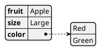
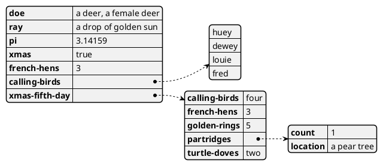
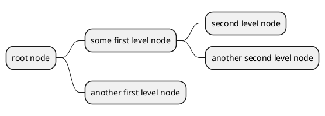

---
related:
  - "[[PlantUML]]"
  - "[[JSON]]"
  - "[[Diagram]]"
  - "[[UML]]"
"":
---
## [[JSON]]

## [[yaml]]

## mindmap
- [ ] #task move to [[PlantUML]] docs

==only works with an empty line at the start==  https://github.com/joethei/obsidian-plantuml/issues/50
