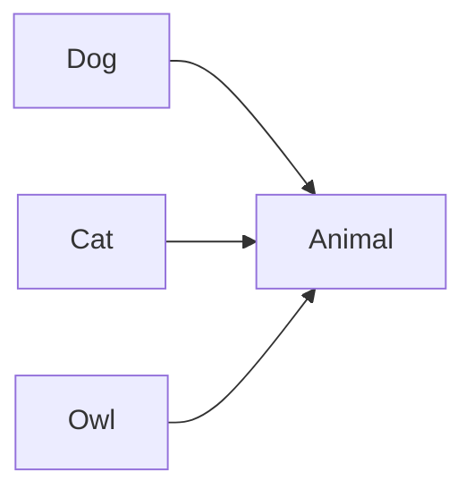
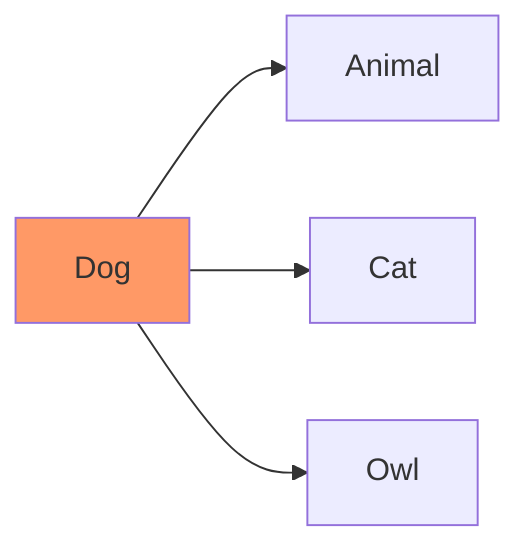
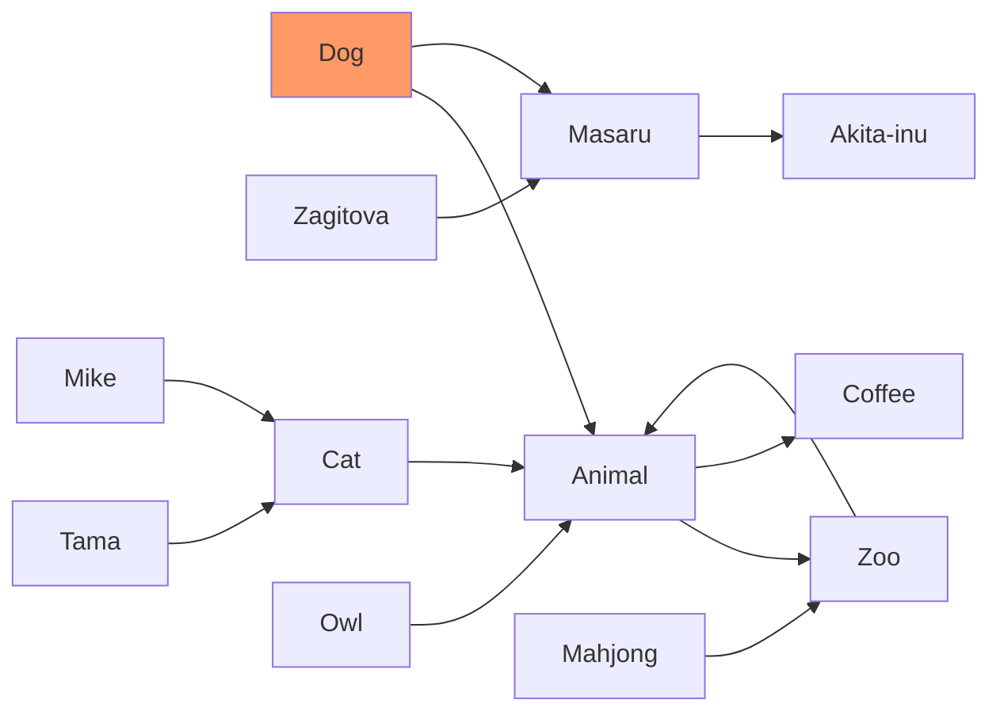
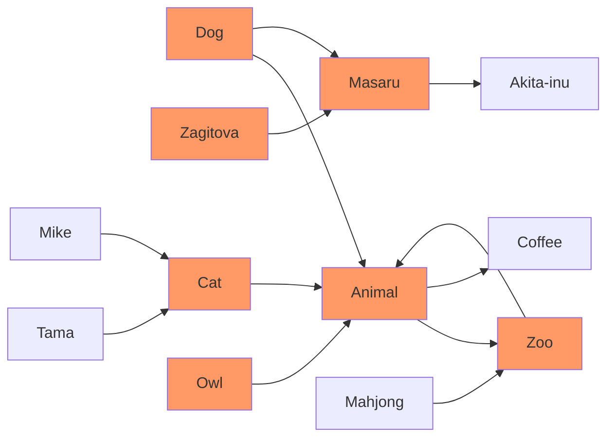

---
author:
  - "[[semantic-release-bot]]"
  - "[[tadashi-aikawa]]"
created: 2025-05-23
source: https://github.com/tadashi-aikawa/obsidian-another-quick-switcher
tags:
  - plugin/obsidian/switch
---
- [/] #task explore [[another-quick-switcher]] plugin 🆔 duK0ss
	- [x] `shift ctr m` to move file
	- [ ] ..
___

This is an Obsidian plugin which is another choice of Quick switcher. It offers various features, such as:

- Creating custom search commands (`Custom searches`)
- Customizing the hotkeys in the quick switcher to your preference
- Searching backlinks and moving them **without leaving the keyboard** (`Backlink search`)
- Moving a file to another folder (`Move file to another folder`)
- Searching **regardless of the order in which tokens appear**
- Not performing very fuzzy searches by default, but an option is available to enable them
- Searching **considering prefix emoji**
- Showing file names and directory names separately
- Revealing a folder in the file tree (`Reveal a folder in the file tree`)
## ⌨️ Features

[](https://raw.githubusercontent.com/tadashi-aikawa/obsidian-another-quick-switcher/master/demo/custom-searches.gif)

Custom searches enables you to create your original search commands.

[](https://raw.githubusercontent.com/tadashi-aikawa/obsidian-another-quick-switcher/master/demo/search-commands-setting.png)

#### Search target

| Name | Description |
| --- | --- |
| markdown | All markdown files |
| backlink | Markdown files in backlinks on the current file |
| link | Markdown files in outgoing links on the current file |
| [2-hop-link](https://github.com/tadashi-aikawa/#what-is-the-2-hop-link) | Markdown files in 2-hop-links from the current file |
| opened file | Markdown files opened in the current window |

#### Sort priorities

You can use the following names as a `Sort priorities`.

| Name | Description | Since |
| --- | --- | --- |
| Perfect word match | A query matches perfectly with a word in the file name | 6.0.0 |
| Prefix name match | The file name or alias starts with a query | 6.0.0 |
| Name match | The file name or alias includes a query | 6.0.0 |
| Fuzzy name match | The file name or alias matches fuzzy with a query | 8.10.0 |
| Tag match | The query includes the file's tag name | 6.0.0 |
| Header match | The query includes the file's header name | 6.0.0 |
| Link match | The query includes the file's internal link name | 6.0.0 |
| Property match | The query includes the file's property name | 11.0.0 |
| Length | Length of the file name or alias | 6.0.0 |
| Last opened | The time the file opened last | 6.0.0 |
| Last modified | The time the file modified last | 6.0.0 |
| Star | The file has a star | 6.0.0 |
| Alphabetical | File name or alias order by alphabetically ascend | 6.2.0 |
| Alphabetical reverse | File name or alias order by alphabetically descend | 7.0.0 |
| Created latest | File creation date from the latest to the earliest | 7.0.0 |
| Created earliest | File creation date from the earliest to the latest | 7.0.0 |
| (Tags split by comma) | The file has specific tags | 7.0.0 |
| (Extensions split by comma) | The file has specific extensions | 8.3.0 |

> **Warning** Please don't forget to click the `Save` button before you close Obsidian. Otherwise, the settings **will never restore** when you open Obsidian next time.[](https://raw.githubusercontent.com/tadashi-aikawa/obsidian-another-quick-switcher/master/demo/save-button.png)

> **Note** Examples of `(Tags spit by comma)` are `#hoge`, `#hoge,#huga`, and so on.

> **Note** Examples of `(Extensions spit by comma)` are `.md`, `.md,.canvas`, and so on.

Recent search [](https://raw.githubusercontent.com/tadashi-aikawa/obsidian-another-quick-switcher/master/demo/recent-search-setting.webp) File name search [](https://raw.githubusercontent.com/tadashi-aikawa/obsidian-another-quick-switcher/master/demo/file-name-search-setting.webp) File name fuzzy search [](https://raw.githubusercontent.com/tadashi-aikawa/obsidian-another-quick-switcher/master/demo/file-name-fuzzy-search-setting.webp) Landmark search [](https://raw.githubusercontent.com/tadashi-aikawa/obsidian-another-quick-switcher/master/demo/landmark-search-setting.webp) Star search [](https://raw.githubusercontent.com/tadashi-aikawa/obsidian-another-quick-switcher/master/demo/star-search-setting.webp) 2 hop link search [](https://raw.githubusercontent.com/tadashi-aikawa/obsidian-another-quick-switcher/master/demo/2-hop-link-search-setting.webp) 

#### Note

- `"ho ge"` matches only `ho ge` and does not match `hoge`.
- `ho ge` matches both `ho ge` and `hoge`.

Example: Suppose there are three files:

- `hoge.md`
- `hoge`
- `mdhoge`

The input `hoge -md` will suggest only `hoge`.

Additionally, you can specify a custom string as the exclude prefix using the `Exclude prefix` setting.

If the path of the active file is "/usr/local/vault/notes", the query " `<cd>` obsidian" will be interpreted as "/usr/local/vault/notes obsidian".

[](https://raw.githubusercontent.com/tadashi-aikawa/obsidian-another-quick-switcher/master/demo/header-floating-search-in-file.gif)

- Show all headers even after filtering to retain file structures in the brain
- Jump to the first hit suggestion automatically and move next/previous by `Tab/Shift+Tab` as default
- Queries enclosed in double quotes are searched as is
	- `"ho ge"` only matches `ho ge` not `hoge`
	- `ho ge` matches both `ho ge` and `hoge`

### 3\. Grep

This feature requires [ripgrep](https://github.com/BurntSushi/ripgrep) and set the executable command to "Ripgrep command" option.

[](https://raw.githubusercontent.com/tadashi-aikawa/obsidian-another-quick-switcher/master/demo/grep.gif)

It sorts results by modified time descending.

#### Default hotkeys

- `TAB`: Search
	- If you want to search in real-time, please set the "Grep search delay milli-seconds" option to 1 or more
- `Ctrl+,`: preview

#### Note

- Input regards as a regex pattern
- Grep searches only markdown files as default. If you want to search for other extensions, please update the "Grep > Extensions" settings

Detailed hotkeys customization is available for each dialog.

[](https://raw.githubusercontent.com/tadashi-aikawa/obsidian-another-quick-switcher/master/demo/customizable-hotkeys-setting.png)

The new Backlink search enables displaying all occurrences in the same file and listing the corresponding lines' text.

5-backlink-search.mp4<video src="https://private-user-images.githubusercontent.com/9500018/264975457-0ce0111a-7481-40a0-a49e-ab00a2f37b35.mp4?jwt=eyJhbGciOiJIUzI1NiIsInR5cCI6IkpXVCJ9.eyJpc3MiOiJnaXRodWIuY29tIiwiYXVkIjoicmF3LmdpdGh1YnVzZXJjb250ZW50LmNvbSIsImtleSI6ImtleTUiLCJleHAiOjE3NDc5OTExNDgsIm5iZiI6MTc0Nzk5MDg0OCwicGF0aCI6Ii85NTAwMDE4LzI2NDk3NTQ1Ny0wY2UwMTExYS03NDgxLTQwYTAtYTQ5ZS1hYjAwYTJmMzdiMzUubXA0P1gtQW16LUFsZ29yaXRobT1BV1M0LUhNQUMtU0hBMjU2JlgtQW16LUNyZWRlbnRpYWw9QUtJQVZDT0RZTFNBNTNQUUs0WkElMkYyMDI1MDUyMyUyRnVzLWVhc3QtMSUyRnMzJTJGYXdzNF9yZXF1ZXN0JlgtQW16LURhdGU9MjAyNTA1MjNUMDkwMDQ4WiZYLUFtei1FeHBpcmVzPTMwMCZYLUFtei1TaWduYXR1cmU9ZmVmZmFhYjQxZTVmNjRlOTZiMjU1NzYzYzRhNmQwMzU1MzU5YTdiNzAzYmJlZGE3OWU5Njk5ZGVjNDc4OTMxZCZYLUFtei1TaWduZWRIZWFkZXJzPWhvc3QifQ.F7IFaYLNeU2uUNGfZdHvP5AwiHGGMi6wWZrTDwF1zss" controls="controls"></video>

The new Link search enables displaying all occurrences in the same file and listing the corresponding lines' text.

6-link-search.mp4<video src="https://private-user-images.githubusercontent.com/9500018/264975825-b31034e7-7ad7-4ab5-8294-6b4950efe224.mp4?jwt=eyJhbGciOiJIUzI1NiIsInR5cCI6IkpXVCJ9.eyJpc3MiOiJnaXRodWIuY29tIiwiYXVkIjoicmF3LmdpdGh1YnVzZXJjb250ZW50LmNvbSIsImtleSI6ImtleTUiLCJleHAiOjE3NDc5OTExNDgsIm5iZiI6MTc0Nzk5MDg0OCwicGF0aCI6Ii85NTAwMDE4LzI2NDk3NTgyNS1iMzEwMzRlNy03YWQ3LTRhYjUtODI5NC02YjQ5NTBlZmUyMjQubXA0P1gtQW16LUFsZ29yaXRobT1BV1M0LUhNQUMtU0hBMjU2JlgtQW16LUNyZWRlbnRpYWw9QUtJQVZDT0RZTFNBNTNQUUs0WkElMkYyMDI1MDUyMyUyRnVzLWVhc3QtMSUyRnMzJTJGYXdzNF9yZXF1ZXN0JlgtQW16LURhdGU9MjAyNTA1MjNUMDkwMDQ4WiZYLUFtei1FeHBpcmVzPTMwMCZYLUFtei1TaWduYXR1cmU9ZmU5MzQ4ZTFhMTY5ZDFiZmY2MzBkYzM0NWY3MGYxZmM5OTY2ZDRhMzEyMDYxMDg3MTdiZjMyNDM2MzQ5MzY5YyZYLUFtei1TaWduZWRIZWFkZXJzPWhvc3QifQ.p6l_pnyzage_ESJvY5bTRDSJEKOGstUNC5bjNEvOSdM" controls="controls"></video>

"In File search" allows you to search for a specific line within a file using a search keyword and displays it along with the surrounding lines.

2023-10-18\_22h09\_46.mp4<video src="https://private-user-images.githubusercontent.com/9500018/276258132-0b16c4f4-b071-4e05-9402-00ae2525e57c.mp4?jwt=eyJhbGciOiJIUzI1NiIsInR5cCI6IkpXVCJ9.eyJpc3MiOiJnaXRodWIuY29tIiwiYXVkIjoicmF3LmdpdGh1YnVzZXJjb250ZW50LmNvbSIsImtleSI6ImtleTUiLCJleHAiOjE3NDc5OTExNDgsIm5iZiI6MTc0Nzk5MDg0OCwicGF0aCI6Ii85NTAwMDE4LzI3NjI1ODEzMi0wYjE2YzRmNC1iMDcxLTRlMDUtOTQwMi0wMGFlMjUyNWU1N2MubXA0P1gtQW16LUFsZ29yaXRobT1BV1M0LUhNQUMtU0hBMjU2JlgtQW16LUNyZWRlbnRpYWw9QUtJQVZDT0RZTFNBNTNQUUs0WkElMkYyMDI1MDUyMyUyRnVzLWVhc3QtMSUyRnMzJTJGYXdzNF9yZXF1ZXN0JlgtQW16LURhdGU9MjAyNTA1MjNUMDkwMDQ4WiZYLUFtei1FeHBpcmVzPTMwMCZYLUFtei1TaWduYXR1cmU9ZWU5M2QyZDgxMjhlNTAzNGFlMmZiZGE4MDZlNjJiZTVhN2E5YTRjNzhiY2IwNzYyNmRmM2QwNjljN2I5MTQyNSZYLUFtei1TaWduZWRIZWFkZXJzPWhvc3QifQ.xtoJl1Yp90U33CnfGvTEoASdG6xUfFhVHhkDGupEYLE" controls="controls"></video>

You can show the backlinks about the suggestion in the dialog. (Default hotkey is `Mod h`)

It can show backlinks from not only existing notes but also phantom(not existing) notes.

[](https://raw.githubusercontent.com/tadashi-aikawa/obsidian-another-quick-switcher/master/demo/show-backlinks-from-the-dialog.gif)

You can navigate outgoing/backlinks without leaving the dialog by using the "show links", "show backlinks", "navigate forward", and "navigate back" commands.

[](https://raw.githubusercontent.com/tadashi-aikawa/obsidian-another-quick-switcher/master/demo/navigate-outgoing-backlinks-without-leaving-the-dialog.gif)

### 10\. Preview

You can preview the file without closing the dialog. (Default hotkey is `Mod ,`)

It shows a floating view that doesn't distract the contents. Additionally, it makes the editor state before opening the dialog after previewing files and closing the dialog.

2023-02-05\_16h05\_11.mp4<video src="https://private-user-images.githubusercontent.com/9500018/216806330-daf57b52-d8a4-42e3-9803-ba7d76a93319.mp4?jwt=eyJhbGciOiJIUzI1NiIsInR5cCI6IkpXVCJ9.eyJpc3MiOiJnaXRodWIuY29tIiwiYXVkIjoicmF3LmdpdGh1YnVzZXJjb250ZW50LmNvbSIsImtleSI6ImtleTUiLCJleHAiOjE3NDc5OTExNDgsIm5iZiI6MTc0Nzk5MDg0OCwicGF0aCI6Ii85NTAwMDE4LzIxNjgwNjMzMC1kYWY1N2I1Mi1kOGE0LTQyZTMtOTgwMy1iYTdkNzZhOTMzMTkubXA0P1gtQW16LUFsZ29yaXRobT1BV1M0LUhNQUMtU0hBMjU2JlgtQW16LUNyZWRlbnRpYWw9QUtJQVZDT0RZTFNBNTNQUUs0WkElMkYyMDI1MDUyMyUyRnVzLWVhc3QtMSUyRnMzJTJGYXdzNF9yZXF1ZXN0JlgtQW16LURhdGU9MjAyNTA1MjNUMDkwMDQ4WiZYLUFtei1FeHBpcmVzPTMwMCZYLUFtei1TaWduYXR1cmU9MDI5NzkyZmNjMDI0NzI4OGE5NmJmNDVjNDAzM2MzYmViMGIyZmFkNTE3MGJkN2MwOTA1ZWJkYmRiYjA5OGQ0NiZYLUFtei1TaWduZWRIZWFkZXJzPWhvc3QifQ.QbD83TJyp0HZNK5sLVu6Mx3-Ooc0Xasd5WZh4MRCDe0" controls="controls"></video>

In v13, we removed `Link search` from `Preset search commands`. Please see #275 for details about this decision. If you need the previous `Link search` functionality, you can add it to `Search commands` with the configuration shown in the image below.

Open "Link search" configuration [](https://raw.githubusercontent.com/tadashi-aikawa/obsidian-another-quick-switcher/master/demo/link-search-setting.webp) 

Please read a "🔥 Breaking changes" section in the .

Please read a "🔥 Breaking changes" section in the .

Please read a "🔥 Breaking changes" section in the .

It both supports desktop and mobile.

Please create a new [issue](https://github.com/tadashi-aikawa/obsidian-another-quick-switcher/issues).

---

### Pull requests

Sorry, I would not accept the pull requests except for the following cases.

1. Fix obvious bugs
2. Fix typo or wrong documentation
3. If I ask for it in the GitHub issues or the discussions

### Development

#### Set up

```
git config core.hooksPath hooks
```

#### Install dependencies

[Bun](https://bun.sh/) is required.

```
bun i
bun dev
```

### Release

Run [Release Action](https://github.com/tadashi-aikawa/obsidian-another-quick-switcher/actions/workflows/release.yaml) manually.

## Appendix

[2-hop-link](https://github.com/tadashi-aikawa/#what-is-the-2-hop-link) are **outgoing links in the current file**, and files that have outgoing links to them.

For example, If there are relations as follows,



[2-hop-link](https://github.com/tadashi-aikawa/#what-is-the-2-hop-link) from the "Dog" is as follows.



More complicated example.



[2-hop-link](https://github.com/tadashi-aikawa/#what-is-the-2-hop-link) from the "Dog" is as follows.


