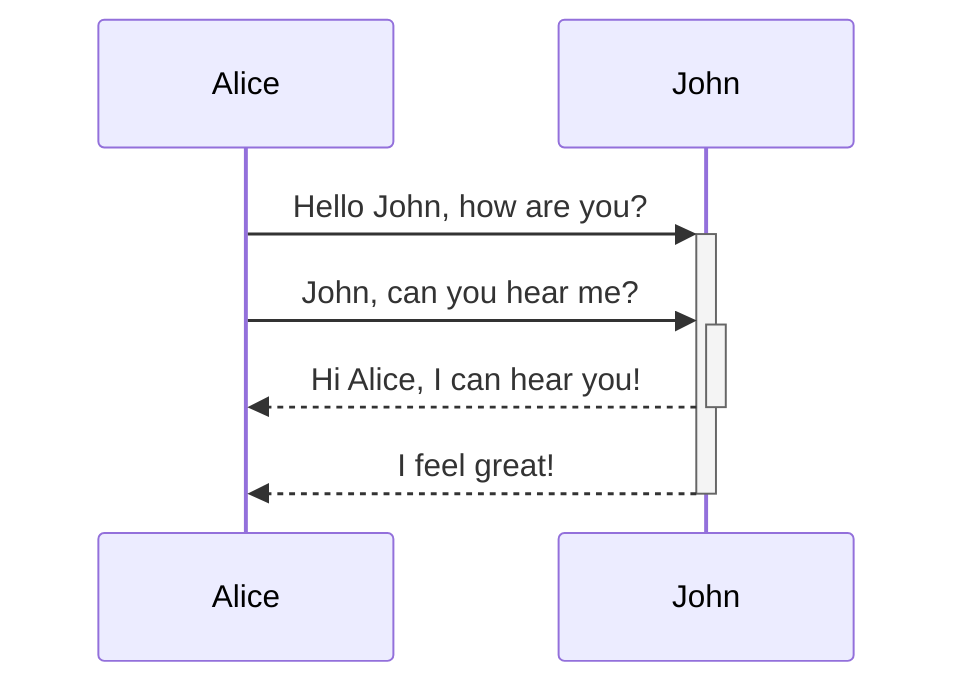
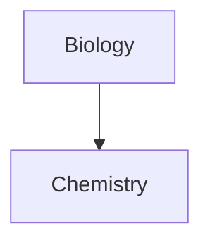

```yaml
aliases:
  - Advanced Markdown
```

Learn how to add advanced formatting syntax to your notes.

## Tables

You can create tables using vertical bars (`|`) to separate columns and hyphens (`-`) to define headers. Here's an example:

```md
| First name | Last name |
| ---------- | --------- |
| Max        | Planck    |
| Marie      | Curie     |
```

| First name | Last name |
| --- | --- |
| Max | Planck |
| Marie | Curie |

While the vertical bars on either side of the table are optional, including them is recommended for readability.

In *Live Preview*, you can right-click a table to add or delete columns and rows. You can also sort and move them using the context menu.

You can insert a table using the **Insert Table** command from the [Command Palette](https://help.obsidian.md/Plugins/Command+palette) or by right-clicking and selecting *Insert → Table*. This will give you a basic, editable table:

```md
|     |     |
| --- | --- |
|     |     |
```

Note that cells don't need perfect alignment, but the header row must contain at least two hyphens:

```md
First name | Last name
-- | --
Max | Planck
Marie | Curie
```

### Format content within a table

If you want to use [aliases](https://help.obsidian.md/Linking+notes+and+files/Aliases), or to [resize an image](https://help.obsidian.md/Editing+and+formatting/Basic+formatting+syntax#External%20images) in your table, you need to add a `\` before the vertical bar.

```md
First column | Second column
-- | --
[[Basic formatting syntax\|Markdown syntax]] | ![[Engelbart.jpg\|200]]
```

| First column | Second column |
| --- | --- |
| [Markdown syntax](https://help.obsidian.md/Editing+and+formatting/Basic+formatting+syntax) |  |

Align text in columns by adding colons (`:`) to the header row. You can also align content in *Live Preview* via the context menu.

```md
Left-aligned text | Center-aligned text | Right-aligned text
:-- | :--: | --:
Content | Content | Content
```

| Left-aligned text | Center-aligned text | Right-aligned text |
| --- | --- | --- |
| Content | Content | Content |

## Diagram

You can also try Mermaid's [Live Editor](https://mermaid-js.github.io/mermaid-live-editor) to help you build diagrams before you include them in your notes.



```md
\`\`\`mermaid
graph TD

Biology --> Chemistry
\`\`\`
```

### Linking files in a diagram

You can create [internal links](https://help.obsidian.md/Linking+notes+and+files/Internal+links) in your diagrams by attaching the `internal-link` [class](https://mermaid.js.org/syntax/flowchart.html#classes) to your nodes.



Internal links from diagrams don't show up in the [Graph view](https://help.obsidian.md/Plugins/Graph+view).

If you have many nodes in your diagrams, you can use the following snippet.


This way, each letter node becomes an internal link, with the [node text](https://mermaid.js.org/syntax/flowchart.html#a-node-with-text) as the link text.

If you use special characters in your note names, you need to put the note name in double quotes.

```
class "⨳ special character" internal-link
```

Or, `A["⨳ special character"]`.

## Math

You can add math expressions to your notes using [MathJax](http://docs.mathjax.org/en/latest/basic/mathjax.html) and the LaTeX notation.

To add a MathJax expression to your note, surround it with double dollar signs (`$$`).

```md
$$
\begin{vmatrix}a & b\\
c & d
\end{vmatrix}=ad-bc
$$
```

You can also inline math expressions by wrapping it in `$` symbols.

```md
This is an inline math expression $e^{2i\pi} = 1$.
```

This is an inline math expression $e^{2 i \pi} = 1$.