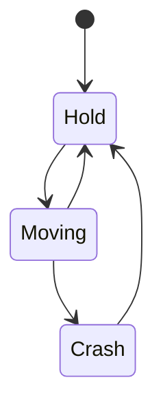
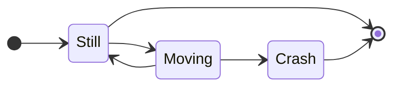

## state diagrams

```mermaid
stateDiagram-v2
        [*] --> Hold
    
        Hold --> Moving
        Moving --> Hold
        Moving --> Crash
        Crash --> Hold

```

```mermaid
stateDiagram-v2
        direction LR
        [*] --> Still
        Still --> [*]
    
        Still --> Moving
        Moving --> Still
        Moving --> Crash
        Crash --> [*]
```