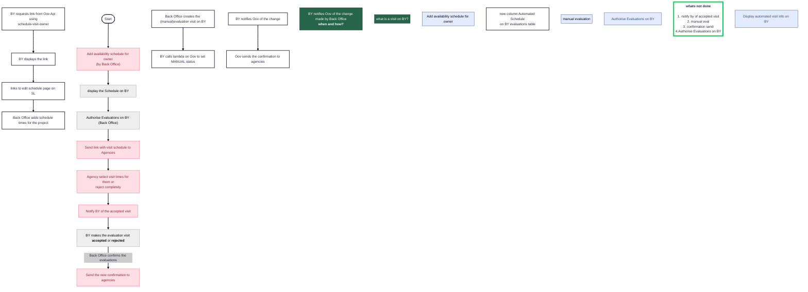

#artifact

[mermaid](https://www.mermaidchart.com/play?utm_source=mermaid_js&utm_medium=editor_selection&utm _campaign=playground#pako:eNqVVEtu2zAQvcpA2SRAjEb-R0iNKrGzKpoAbhdF1QUjjSzWNKmQlD8IcoPeoLfrSTrUx1KDFGi0EofvzZt5Q_LJi1WCXuD1er1IxkqmfBVEEsBmuMEANCbF3q0FO6jCBpDyPSaRLOGpULs4Y9rC57nDAEj_9FvkLS3FIu_7GfR6M5D9D09Ef0ARQORdmZxJMPYg8H0URSQvlA7c3yxMEmBbxgnLBbcHMHFG8gIhVRrUTqK-eufos8iD51pw9IrghELXX6n2xwKNNSC4XEOq1Qbu1BbCnBO0pk8qxrRiJNzk1Khx3ZesFjitgJcEdBsEUYAJt22ROVshKAnLjy3rsmL5Fy4_i9dwl6Y8RmBJYlqm5Rs0ZZNON9fqB8a2TdKvk_QpSV0hLGtui_IvatiAYHNu2IMzrtCUUpeVcrnqoJukQ0KHhc2U5gZhsWWiYJYraU479Z51iMOaOHa-o0wqd3fcZrDlpmsIORSuUMYcTYc_rvluSM02GBTUcp3gLzs2oPTVg55pdKZUkVhtcoEWxaGTt56k7yb0RVpuBSbwiQ73EXP9RMZgTBpKRl5zgFwf_3HyOkp-ZZnakFHxa5MYEeD3z1-dCdINMBnLywsV26N0G7a4P4Z9_x_x0atxyhMEwT2X2F0v14dm6fu0Dh8LVgViwYyZYwqOQjdRqzX2djyxWeDn-_MmkjCS0podAqkkNuHgpD8aDgbjc3oIhKDVZDwahudQXeOT2_J7oUOlvF1mMBnOJzeNzKK_uL69PcpUmy9kXIdv1xmOF_ObaaMzX1D5047OdDEJK53yySJvm72L8ouk9_wHF-ewPg) flowchart 

