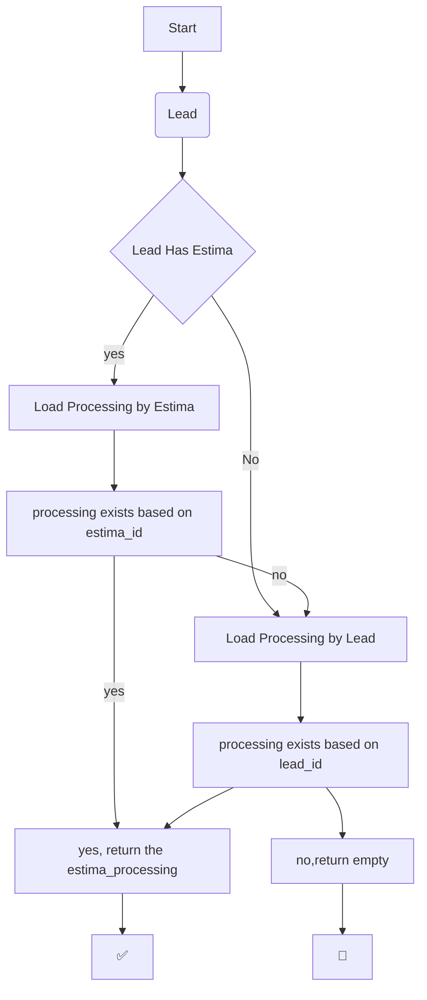

```mermaid
flowchart
    A["Start"] --> B("Lead<br>")
    C{"Lead Has Estima<br>"} -- yes --> D["Load Processing by Estima<br>"]
    C -- No --> F["<span style="padding-left: 8px; padding-right: 8px; color: rgb(51, 51, 51);">Load Processing by Lead</span>"]
    B --> C

    D --> n1["processing exists based on estima_id<br>"]

    n1 -- yes --> n6["yes, return the estima_processing"]
    n1 -- no --> F

    F --> n4["processing exists based on lead_id<br>"]
    n4 --> n5["no,return empty"] & n6["yes, return the estima_processing"]

    n5 --> n8["🚫"]
    n6 --> n9["✅"]
```
