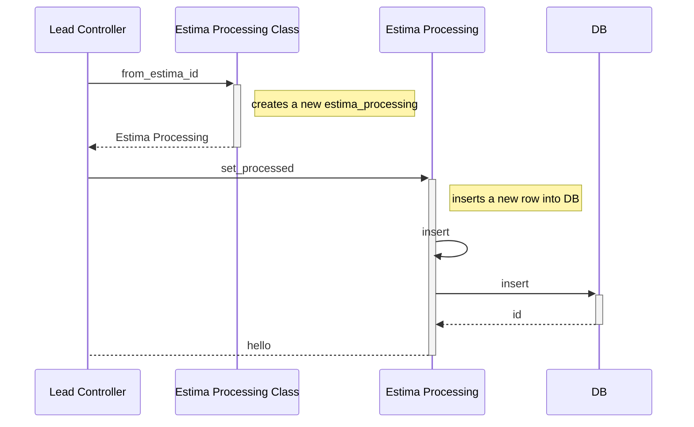

## participants
- Lead controller
	- estima_processing **class**
	- estima_processing (object)
		- DB
## diagram

```mermaid
sequenceDiagram 
	participant LC as Lead Controller
    participant ECP as Estima Processing Class
    participant EP as Estima Processing
    participant DB as DB
	
    LC->>+ECP: from_estima_id
    Note right of ECP: creates a new estima_processing
	ECP-->>-LC: Estima Processing
	LC->>+EP: set_processed
	Note right of EP: inserts a new row into DB
	EP->>EP: insert
	EP->>+DB: insert
	DB-->>-EP: id
	EP-->-LC: hello
```
