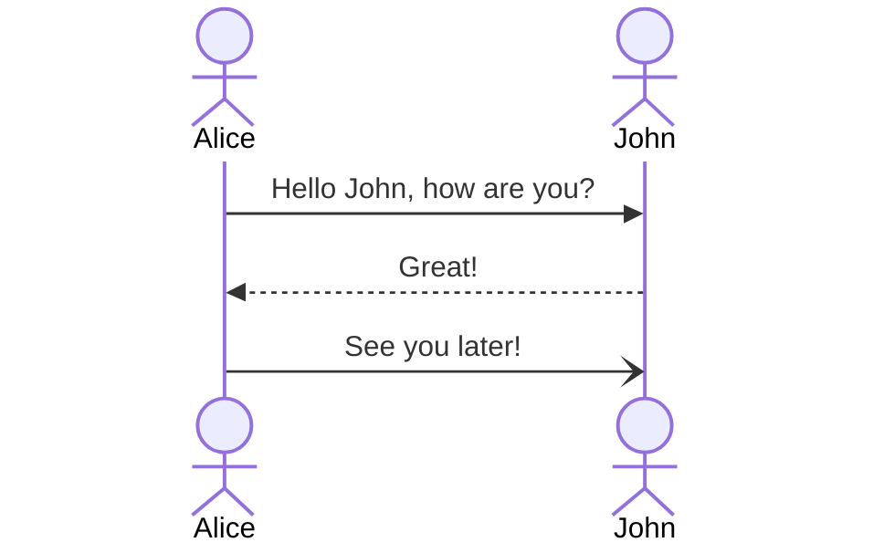

#encapsulation
#polymorphism 
#abstraction
#oop
#objects
## The World According to Objects
[[2024-07-22]]

## What are objects?
![[Atlas/Knowledge/concepts/CS/OOP/smalltalk/lawyer.png]]
 
`Correspondence between our perception of the world and its representation in machine terms through Smalltalk gets at the heart of Smalltalk's power.`

#encapsulation 
!!!Related data and <mark style="background: #FF5582A6;">program</mark> <mark style="background: #FFB8EBA6;">pieces</mark> are **encapsulated** within a Smalltalk object, a
**communicating black box**.

#communication
#collaboration
#messaging

...And if an object needs something done that it does not know how to do
within its own set of methods, it **sends a message** to another object, in effect, asking for
assistance in the completion of a task.

**...Smalltalks object's methods do not call other objects' methods directly.**

In OOPS terms, [[Atlas/Knowledge/Knowledge/concepts/CS/information hiding - encapsulation]] — as this **<mark style="background: #FF5582A6;">encapsulation</mark>** of code and data is known in computer science—makes for highly portable, easily modifiable and safe software. 

Large applications may be easily maintained since objects may be updated, recompiled, tested
and called immediately back into service with their new behavioral capabilities on line.

#data-structure 
#abstract-data-types
`Where it is generally an exception or nuisance in conventional languages, creating new data structures is done routinely when you define a new class or subclass of objects in Smalltalk`

#communication 
## How do objects communicate and behave?

#responsibility
`Smalltalk objects take responsibility for their own actions, responding individually to every message.`

 Each of the elementary data types knows how to perform generally required behaviors such as print, duplicate and comparison operations.

`Integers, arrays and characters take care of getting themselves represented on paper.`

#polymorphism
 This Smalltalk characteristic of having different objects responding **uniquely** to the **same**
**message** is known as **[[Atlas/Knowledge/Knowledge/concepts/CS/OOP/polymorphism]]**.

Smalltalk guarantees that there will be a response by a message recipient. If an object
determines that it does not know how to perform a requested behavior, it will at least
answer with a "**Message not understood**" response message.

#prototype
#evolution
#complexity
#emergence 
`A working prototype can be constructed quickly and enhancements integrated easily into the evolving system.`

## How does Smalltalk organize objects and their methods?

