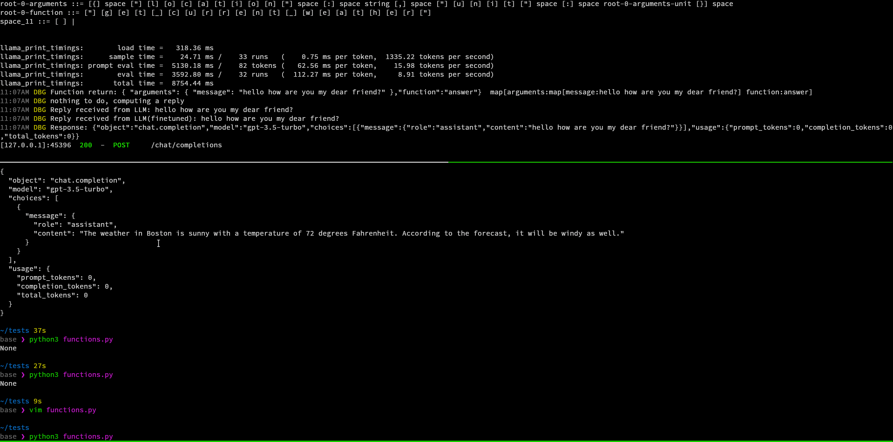
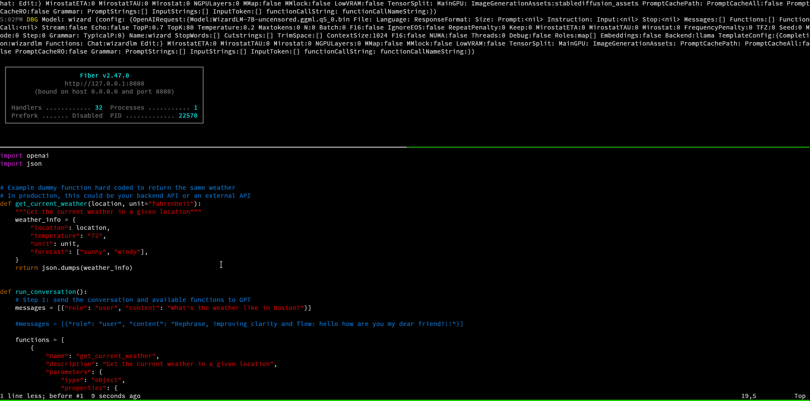

-   [{style="width:calc(65%);height:calc(65%)"}](../../index.html){aria-label="HomePage"
    alt="HomePage"}

    LocalAI

-   [](https://github.com/go-skynet/LocalAI/releases)

-   [](https://hub.docker.com/r/localai/localai){target="_blank"}
    [](https://quay.io/repository/go-skynet/local-ai?tab=tags&tag=latest){target="_blank"}

-   [*info* Overview](../../index.html){.sidebar-root-link}
-   *rocket_launch* Getting started

    -   [Quickstart](../getting_started/index.html){.sidebar-nested-link}
    -   [Install and Run
        Models](https://localai.io/docs/getting-started/models/){.sidebar-nested-link}
    -   [Try it out](../try/index.html){.sidebar-nested-link}
    -   [Customizing the
        Model](https://localai.io/docs/getting-started/customize-model/){.sidebar-nested-link}
    -   [Build LocalAI from
        source](../build/index.html){.sidebar-nested-link}
    -   [Run with container
        images](../container/index.html){.sidebar-nested-link}
    -   [Run with
        Kubernetes](../kubernetes/index.html){.sidebar-nested-link}
-   [*newspaper* News](index.html){.sidebar-root-link}
-   *feature_search* Features

    -   [⚡ GPU
        acceleration](../../features/gpu-acceleration/index.html){.sidebar-nested-link}
    -   [📖 Text generation
        (GPT)](../../features/text-generation/index.html){.sidebar-nested-link}
    -   [📈
        Reranker](../../features/reranker/index.html){.sidebar-nested-link}
    -   [🗣 Text to audio
        (TTS)](../../features/text-to-audio/index.html){.sidebar-nested-link}
    -   [🎨 Image
        generation](../../features/image-generation/index.html){.sidebar-nested-link}
    -   [🧠
        Embeddings](../../features/embeddings/index.html){.sidebar-nested-link}
    -   [🥽 GPT
        Vision](../../features/gpt-vision/index.html){.sidebar-nested-link}
    -   [✍️ Constrained
        Grammars](../../features/constrained_grammars/index.html){.sidebar-nested-link}
    -   [🆕🖧 Distributed
        Inference](../../features/distribute/index.html){.sidebar-nested-link}
    -   [🔈 Audio to
        text](../../features/audio-to-text/index.html){.sidebar-nested-link}
    -   [🔥 OpenAI functions and
        tools](../../features/openai-functions/index.html){.sidebar-nested-link}
    -   [💾 Stores](../../stores/index.html){.sidebar-nested-link}
    -   [🖼️ Model
        gallery](../../models/index.html){.sidebar-nested-link}
-   [*sync*
    Integrations](https://localai.io/docs/integrations/){.sidebar-root-link}
-   *settings* Advanced

    -   [Advanced
        usage](../../advanced/index.html){.sidebar-nested-link}
    -   [Fine-tuning LLMs for text
        generation](https://localai.io/docs/advanced/fine-tuning/){.sidebar-nested-link}
    -   [Installer
        options](https://localai.io/docs/advanced/installer/){.sidebar-nested-link}
-   *menu_book* References

    -   [Model compatibility
        table](../../model-compatibility/index.html){.sidebar-nested-link}
    -   [Architecture](https://localai.io/docs/reference/architecture/){.sidebar-nested-link}
    -   [LocalAI
        binaries](https://localai.io/docs/reference/binaries/){.sidebar-nested-link}
    -   [Running on Nvidia
        ARM64](https://localai.io/docs/reference/nvidia-l4t/){.sidebar-nested-link}
-   [*quiz* FAQ](../../faq/index.html){.sidebar-root-link}

[](../../index.html){.logo-icon .me-3 aria-label="HomePage"
alt="HomePage"}

{#Layer_1}

{#Layer_1}

[menu]{.material-icons .size-20 .menu-icon .align-middle}

[search]{.material-icons .size-20 .menu-icon .align-middle}
[Search]{.flexsearch-button-placeholder .ms-1 .me-2 .d-none .d-sm-block}

[[![](data:image/svg+xml;base64,PHN2ZyB3aWR0aD0iNDQiIGhlaWdodD0iMTUiPjxwYXRoIGQ9Ik0yLjExOCAxMS41QTEuNTE5IDEuNTE5LjAgMDExIDExLjA0MiAxLjU4MyAxLjU4My4wIDAxMSA4LjgxNWExLjUxOSAxLjUxOS4wIDAxMS4xMTMtLjQ1OGguNzE1VjYuNjQzaC0uNzFBMS41MTkgMS41MTkuMCAwMTEgNi4xODUgMS41MTkgMS41MTkuMCAwMS41NDcgNS4wNzEgMS41MTkgMS41MTkuMCAwMTEgMy45NTggMS41MTkgMS41MTkuMCAwMTIuMTE4IDMuNWExLjUxOSAxLjUxOS4wIDAxMS4xMTQuNDU4QTEuNTE5IDEuNTE5LjAgMDEzLjY5IDUuMDcxdi43MTVINS40VjUuMDcxQTEuNTY0IDEuNTY0LjAgMDE2Ljk3NiAzLjUgMS41NjQgMS41NjQuMCAwMTguNTQ3IDUuMDcxIDEuNTY0IDEuNTY0LjAgMDE2Ljk3NiA2LjY0M0g2LjI2MVY4LjM1N2guNzE1YTEuNTc1IDEuNTc1LjAgMDExLjExMyAyLjY4NSAxLjU4MyAxLjU4My4wIDAxLTIuMjI3LjBBMS41MTkgMS41MTkuMCAwMTUuNCA5LjkyOVY5LjIxNEgzLjY5di43MTVhMS41MTkgMS41MTkuMCAwMS0uNDU4IDEuMTEzQTEuNTE5IDEuNTE5LjAgMDEyLjExOCAxMS41em0wLS44NTdhLjcxNC43MTQuMCAwMC43MTUtLjcxNFY5LjIxNEgyLjExOGEuNzE1LjcxNS4wIDEwMCAxLjQyOXptNC44NTguMGEuNzE1LjcxNS4wIDEwMC0xLjQyOUg2LjI2MXYuNzE1YS43MTQuNzE0LjAgMDAuNzE1LjcxNHpNMy42OSA4LjM1N0g1LjRWNi42NDNIMy42OXpNMi4xMTggNS43ODZoLjcxNVY1LjA3MWEuNzE0LjcxNC4wIDAwLS43MTUtLjcxNC43MTUuNzE1LjAgMDAtLjUgMS4yMkEuNjg2LjY4Ni4wIDAwMi4xMTggNS43ODZ6bTQuMTQzLjBoLjcxNWEuNzE1LjcxNS4wIDAwLjUtMS4yMi43MTUuNzE1LjAgMDAtMS4yMi41eiIgZmlsbD0iY3VycmVudGNvbG9yIiAvPjxwYXRoIGQ9Ik0xMi40IDExLjQ3NUgxMS4zNDRsMy44NzktNy45NWgxLjA1NnoiIGZpbGw9ImN1cnJlbnRjb2xvciIgLz48cGF0aCBkPSJNMjUuMDczIDUuMzg0bC0uODY0LjU3NmEyLjEyMSAyLjEyMS4wIDAwLTEuNzg2LS45MjMgMi4yMDcgMi4yMDcuMCAwMC0yLjI2NiAyLjMyNiAyLjIwNiAyLjIwNi4wIDAwMi4yNjYgMi4zMjUgMi4xIDIuMS4wIDAwMS43ODItLjkxOGwuODQuNjE3YTMuMTA4IDMuMTA4LjAgMDEtMi42MjIgMS4yOTMgMy4yMTcgMy4yMTcuMCAwMS0zLjM0OS0zLjMxNyAzLjIxNyAzLjIxNy4wIDAxMy4zNDktMy4zMTdBMy4wNDYgMy4wNDYuMCAwMTI1LjA3MyA1LjM4NHoiIGZpbGw9ImN1cnJlbnRjb2xvciIgLz48cGF0aCBkPSJNMzAuOTkzIDUuMTQyaC0yLjA3djUuNDE5SDI3Ljg5MVY1LjE0MmgtMi4wN1Y0LjE2NGg1LjE3MnoiIGZpbGw9ImN1cnJlbnRjb2xvciIgLz48cGF0aCBkPSJNMzQuNjcgNC4xNjRjMS40NzEuMCAyLjI2Ni42NTggMi4yNjYgMS44NTEuMCAxLjA4Ny0uODMyIDEuODA5LTIuMTM0IDEuODU1bDIuMTA3IDIuNjkxaC0xLjI4TDMzLjU5MSA3Ljg3SDMzLjA3djIuNjkxSDMyLjAzOHYtNi40em0tMS42Ljk2OXYxLjhoMS41NzJjLjgzMi4wIDEuMjItLjMgMS4yMi0uOTE4cy0uNDExLS44ODItMS4yMi0uODgyeiIgZmlsbD0iY3VycmVudGNvbG9yIiAvPjxwYXRoIGQ9Ik00Mi44ODMgMTAuNTYxSDM4LjMxdi02LjRoMS4wMzNWOS41ODNoMy41NHoiIGZpbGw9ImN1cnJlbnRjb2xvciIgLz48L3N2Zz4=)]{.kbd
.flexsearch-button-cmd-key}[]{.kbd
.flexsearch-button-key}]{.flexsearch-button-keys}

##### Star us on GitHub ! 

[Star](https://github.com/mudler/LocalAI){.github-button
color-scheme="no-preference: light; light: light; dark: dark;"
icon="octicon-star" data-size="large" show-count="true"
aria-label="Star mudler/LocalAI on GitHub"}

-   [](https://github.com/mudler/LocalAI){alt="github"
    rel="noopener noreferrer" target="_blank"}

    
-   [](https://twitter.com/LocalAI_API){alt="twitter"
    rel="noopener noreferrer" target="_blank"}

    
-   [](../../index.xml){alt="rss" rel="noopener noreferrer"
    target="_blank"}

    

[]{.toggle-dark}[![](data:image/svg+xml;base64,PHN2ZyB4bWxucz0iaHR0cDovL3d3dy53My5vcmcvMjAwMC9zdmciIGhlaWdodD0iMzAiIHdpZHRoPSIzMCIgdmlld2JveD0iMCAwIDQ4IDQ4IiBmaWxsPSJjdXJyZW50Y29sb3IiPjx0aXRsZT5FbmFibGUgbGlnaHQgbW9kZTwvdGl0bGU+PHBhdGggZD0iTTI0IDMxcTIuOS4wIDQuOTUtMi4wNVQzMSAyNHQtMi4wNS00Ljk1VDI0IDE3dC00Ljk1IDIuMDVUMTcgMjR0Mi4wNSA0Ljk1VDI0IDMxem0wIDNxLTQuMTUuMC03LjA3NS0yLjkyNVQxNCAyNHQyLjkyNS03LjA3NVQyNCAxNHQ3LjA3NSAyLjkyNVQzNCAyNHQtMi45MjUgNy4wNzVUMjQgMzR6TTMuNSAyNS41cS0uNjUuMC0xLjA3NS0uNDI1UTIgMjQuNjUgMiAyNHQuNDI1LTEuMDc1UTIuODUgMjIuNSAzLjUgMjIuNWg1cS42NS4wIDEuMDc1LjQyNVExMCAyMy4zNSAxMCAyNHQtLjQyNSAxLjA3NVQ4LjUgMjUuNXptMzYgMHEtLjY1LjAtMS4wNzUtLjQyNVEzOCAyNC42NSAzOCAyNHQuNDI1LTEuMDc1VDM5LjUgMjIuNWg1cS42NS4wIDEuMDc1LjQyNVE0NiAyMy4zNSA0NiAyNHQtLjQyNSAxLjA3NS0xLjA3NS40MjV6TTI0IDEwcS0uNjUuMC0xLjA3NS0uNDI1UTIyLjUgOS4xNSAyMi41IDguNXYtNXEwLS42NS40MjUtMS4wNzVRMjMuMzUgMiAyNCAydDEuMDc1LjQyNVQyNS41IDMuNXY1cTAgLjY1LS40MjUgMS4wNzVRMjQuNjUgMTAgMjQgMTB6bTAgMzZxLS42NS4wLTEuMDc1LS40MjVUMjIuNSA0NC41di01cTAtLjY1LjQyNS0xLjA3NVEyMy4zNSAzOCAyNCAzOHQxLjA3NS40MjUuNDI1IDEuMDc1djVxMCAuNjUtLjQyNSAxLjA3NVEyNC42NSA0NiAyNCA0NnpNMTIgMTQuMWwtMi44NS0yLjhxLS40NS0uNDUtLjQyNS0xLjA3NS4wMjUtLjYyNS40MjUtMS4wNzUuNDUtLjQ1IDEuMDc1LS40NXQxLjA3NS40NUwxNC4xIDEycS40LjQ1LjQgMS4wNS4wLjYtLjQgMS0uNC40NS0xLjAyNS40NVQxMiAxNC4xem0yNC43IDI0Ljc1TDMzLjkgMzZxLS40LS40NS0uNC0xLjA3NXQuNDUtMS4wMjVxLjQtLjQ1IDEtLjQ1dDEuMDUuNDVsMi44NSAyLjhxLjQ1LjQ1LjQyNSAxLjA3NS0uMDI1LjYyNS0uNDI1IDEuMDc1LS40NS40NS0xLjA3NS40NXQtMS4wNzUtLjQ1ek0zMy45IDE0LjFxLS40NS0uNDUtLjQ1LTEuMDUuMC0uNi40NS0xLjA1bDIuOC0yLjg1cS40NS0uNDUgMS4wNzUtLjQyNS42MjUuMDI1IDEuMDc1LjQyNS40NS40NS40NSAxLjA3NXQtLjQ1IDEuMDc1TDM2IDE0LjFxLS40LjQtMS4wMjUuNHQtMS4wNzUtLjR6TTkuMTUgMzguODVxLS40NS0uNDUtLjQ1LTEuMDc1dC40NS0xLjA3NUwxMiAzMy45cS40NS0uNDUgMS4wNS0uNDUuNi4wIDEuMDUuNDUuNDUuNDUuNDUgMS4wNS4wLjYtLjQ1IDEuMDVsLTIuOCAyLjg1cS0uNDUuNDUtMS4wNzUuNDI1LS42MjUtLjAyNS0xLjA3NS0uNDI1ek0yNCAyNHoiIC8+PC9zdmc+)]{.toggle-light}

[]{.kbd
.flexsearch-button-cmd-key}[]{.kbd
.flexsearch-button-cmd-key}[to navigate]{.flexsearch-key-label}

[]{.kbd
.flexsearch-button-cmd-key}[to select]{.flexsearch-key-label}

[]{.kbd
.flexsearch-button-cmd-key}[to close]{.flexsearch-key-label}

cancel


-   [*Home*](../../docs){itemprop="item"}
-   [News]{itemprop="name"}

On this page

-   [Older release notes](index.html#older-release-notes)
    -   [04-12-2023: **v2.0.0**](index.html#04-12-2023-__v200__)
    -   [30-10-2023: **v1.40.0**](index.html#30-10-2023-__v1400__)
    -   [Hot topics](index.html#hot-topics)
        -   [Support for
            ROCm/HIPBLAS](index.html#support-for--rocmhipblas)
        -   [More CLI commands](index.html#more-cli-commands)
    -   [25-09-2023: **v1.30.0**](index.html#25-09-2023-__v1300__)
    -   [26-08-2023: **v1.25.0**](index.html#26-08-2023-__v1250__)
        -   [Attention 🚨](index.html#attention-)
        -   [Image generation
            enhancements](index.html#image-generation-enhancements)
        -   [Lora adapters](index.html#lora-adapters)
        -   [Device management](index.html#device-management)
        -   [Community spotlight](index.html#community-spotlight)
        -   [Changelog summary](index.html#changelog-summary)
    -   [🔥🔥🔥🔥 12-08-2023: **v1.24.0**
        🔥🔥🔥🔥](index.html#-12-08-2023-__v1240__-)
        -   [Major improvements:](index.html#major-improvements)
        -   [🐶 Bark](index.html#-bark)
        -   [🦙 AutoGPTQ](index.html#-autogptq)
        -   [🦙 Exllama](index.html#-exllama)
        -   [🧨 Diffusers](index.html#-diffusers)
        -   [🔑 API Keys](index.html#-api-keys)
        -   [🖼️ Galleries](index.html#-galleries)
        -   [💡 New project](index.html#-new-project)
    -   [🔥🔥 29-07-2023: **v1.23.0**
        🚀](index.html#-29-07-2023-__v1230__-)
    -   [🔥🔥🔥 23-07-2023: **v1.22.0**
        🚀](index.html#-23-07-2023-__v1220__-)
    -   [Huggingface embeddings](index.html#huggingface-embeddings)
    -   [LLaMa 2 has been
        released!](index.html#llama-2-has-been-released)
    -   [Official langchain
        integration](index.html#official-langchain-integration)
    -   [🔥🔥🔥 17-07-2023: **v1.21.0**
        🚀](index.html#-17-07-2023-__v1210__-)
        -   [LocalAI functions](index.html#localai-functions)
        -   [gRPC backends](index.html#grpc-backends)
        -   [`falcon` support](index.html#falcon-support)
        -   [Default pre-compiled
            binaries](index.html#default-pre-compiled-binaries)
    -   [🔥🔥🔥 28-06-2023: **v1.20.0**
        🚀](index.html#-28-06-2023-__v1200__-)
        -   [Exciting New Features
            🎉](index.html#exciting-new-features--1)
        -   [Container images](index.html#container-images)
        -   [Updates](index.html#updates)
        -   [Gallery repositories](index.html#gallery-repositories)
        -   [Text to Audio](index.html#text-to-audio)
    -   [🔥🔥🔥 19-06-2023: **v1.19.0**
        🚀](index.html#-19-06-2023-__v1190__-)
    -   [🔥🔥🔥 06-06-2023: **v1.18.0**
        🚀](index.html#-06-06-2023-__v1180__-)
        -   [New features](index.html#new-features)
        -   [Container images](index.html#container-images-1)
        -   [Dependencies updates](index.html#dependencies-updates)
        -   [Generic](index.html#generic)
        -   [Examples](index.html#examples)
    -   [29-05-2023: **v1.17.0**](index.html#29-05-2023-__v1170__)
    -   [27-05-2023: **v1.16.0**](index.html#27-05-2023-__v1160__)
    -   [Media, Blogs, Social](index.html#media-blogs-social)
    -   [Previous](index.html#previous)

Table of Contents

-   [Older release notes](index.html#older-release-notes)
    -   [04-12-2023: **v2.0.0**](index.html#04-12-2023-__v200__)
    -   [30-10-2023: **v1.40.0**](index.html#30-10-2023-__v1400__)
    -   [Hot topics](index.html#hot-topics)
        -   [Support for
            ROCm/HIPBLAS](index.html#support-for--rocmhipblas)
        -   [More CLI commands](index.html#more-cli-commands)
    -   [25-09-2023: **v1.30.0**](index.html#25-09-2023-__v1300__)
    -   [26-08-2023: **v1.25.0**](index.html#26-08-2023-__v1250__)
        -   [Attention 🚨](index.html#attention-)
        -   [Image generation
            enhancements](index.html#image-generation-enhancements)
        -   [Lora adapters](index.html#lora-adapters)
        -   [Device management](index.html#device-management)
        -   [Community spotlight](index.html#community-spotlight)
        -   [Changelog summary](index.html#changelog-summary)
    -   [🔥🔥🔥🔥 12-08-2023: **v1.24.0**
        🔥🔥🔥🔥](index.html#-12-08-2023-__v1240__-)
        -   [Major improvements:](index.html#major-improvements)
        -   [🐶 Bark](index.html#-bark)
        -   [🦙 AutoGPTQ](index.html#-autogptq)
        -   [🦙 Exllama](index.html#-exllama)
        -   [🧨 Diffusers](index.html#-diffusers)
        -   [🔑 API Keys](index.html#-api-keys)
        -   [🖼️ Galleries](index.html#-galleries)
        -   [💡 New project](index.html#-new-project)
    -   [🔥🔥 29-07-2023: **v1.23.0**
        🚀](index.html#-29-07-2023-__v1230__-)
    -   [🔥🔥🔥 23-07-2023: **v1.22.0**
        🚀](index.html#-23-07-2023-__v1220__-)
    -   [Huggingface embeddings](index.html#huggingface-embeddings)
    -   [LLaMa 2 has been
        released!](index.html#llama-2-has-been-released)
    -   [Official langchain
        integration](index.html#official-langchain-integration)
    -   [🔥🔥🔥 17-07-2023: **v1.21.0**
        🚀](index.html#-17-07-2023-__v1210__-)
        -   [LocalAI functions](index.html#localai-functions)
        -   [gRPC backends](index.html#grpc-backends)
        -   [`falcon` support](index.html#falcon-support)
        -   [Default pre-compiled
            binaries](index.html#default-pre-compiled-binaries)
    -   [🔥🔥🔥 28-06-2023: **v1.20.0**
        🚀](index.html#-28-06-2023-__v1200__-)
        -   [Exciting New Features
            🎉](index.html#exciting-new-features--1)
        -   [Container images](index.html#container-images)
        -   [Updates](index.html#updates)
        -   [Gallery repositories](index.html#gallery-repositories)
        -   [Text to Audio](index.html#text-to-audio)
    -   [🔥🔥🔥 19-06-2023: **v1.19.0**
        🚀](index.html#-19-06-2023-__v1190__-)
    -   [🔥🔥🔥 06-06-2023: **v1.18.0**
        🚀](index.html#-06-06-2023-__v1180__-)
        -   [New features](index.html#new-features)
        -   [Container images](index.html#container-images-1)
        -   [Dependencies updates](index.html#dependencies-updates)
        -   [Generic](index.html#generic)
        -   [Examples](index.html#examples)
    -   [29-05-2023: **v1.17.0**](index.html#29-05-2023-__v1170__)
    -   [27-05-2023: **v1.16.0**](index.html#27-05-2023-__v1160__)
    -   [Media, Blogs, Social](index.html#media-blogs-social)
    -   [Previous](index.html#previous)

*newspaper*

# News {#news .content-title .mb-0}

Release notes have been now moved completely over Github releases.

You can see the release notes
[here](https://github.com/mudler/LocalAI/releases){rel="external"
target="_blank"}.

# Older release notes [*link*](index.html#older-release-notes){.anchor aria-hidden="true"} {#older-release-notes}

## 04-12-2023: **v2.0.0** [*link*](index.html#04-12-2023-__v200__){.anchor aria-hidden="true"} {#04-12-2023-__v200__}

This release brings a major overhaul in some backends.

Breaking/important changes:

-   Backend rename: `llama-stable` renamed to `llama-ggml`
    [1287](https://github.com/go-skynet/LocalAI/pull/1287){target="_blank"
    alt=""}
-   Prompt template changes:
    [1254](https://github.com/go-skynet/LocalAI/pull/1254){target="_blank"
    alt=""} (extra space in roles)
-   Apple metal bugfixes:
    [1365](https://github.com/go-skynet/LocalAI/pull/1365){target="_blank"
    alt=""}

New:

-   Added support for LLaVa and OpenAI Vision API support (
    [1254](https://github.com/go-skynet/LocalAI/pull/1254){target="_blank"
    alt=""} )
-   Python based backends are now using conda to track env dependencies
    (
    [1144](https://github.com/go-skynet/LocalAI/pull/1144){target="_blank"
    alt=""} )
-   Support for parallel requests (
    [1290](https://github.com/go-skynet/LocalAI/pull/1290){target="_blank"
    alt=""} )
-   Support for transformers-embeddings (
    [1308](https://github.com/go-skynet/LocalAI/pull/1308){target="_blank"
    alt=""} )
-   Watchdog for backends (
    [1341](https://github.com/go-skynet/LocalAI/pull/1341){target="_blank"
    alt=""} ). As
    [https://github.com/ggerganov/llama.cpp/issues/3969](https://github.com/ggerganov/llama.cpp/issues/3969){rel="external"
    target="_blank"} is hitting LocalAI's llama-cpp implementation, we
    have now a watchdog that can be used to make sure backends are not
    stalling. This is a generic mechanism that can be enabled for all
    the backends now.
-   Whisper.cpp updates (
    [1302](https://github.com/go-skynet/LocalAI/pull/1302){target="_blank"
    alt=""} )
-   Petals backend (
    [1350](https://github.com/go-skynet/LocalAI/pull/1350){target="_blank"
    alt=""} )
-   Full LLM fine-tuning example to use with LocalAI:
    [https://localai.io/advanced/fine-tuning/](https://localai.io/advanced/fine-tuning/){rel="external"
    target="_blank"}

Due to the python dependencies size of images grew in size. If you still
want to use smaller images without python dependencies, you can use the
corresponding images tags ending with `-core`.

Full changelog:
[https://github.com/mudler/LocalAI/releases/tag/v2.0.0](https://github.com/mudler/LocalAI/releases/tag/v2.0.0){rel="external"
target="_blank"}

## 30-10-2023: **v1.40.0** [*link*](index.html#30-10-2023-__v1400__){.anchor aria-hidden="true"} {#30-10-2023-__v1400__}

This release is a preparation before v2 - the efforts now will be to
refactor, polish and add new backends. Follow up on:
[https://github.com/mudler/LocalAI/issues/1126](https://github.com/mudler/LocalAI/issues/1126){rel="external"
target="_blank"}

## Hot topics [*link*](index.html#hot-topics){.anchor aria-hidden="true"} {#hot-topics}

This release now brings the `llama-cpp` backend which is a c++ backend
tied to llama.cpp. It follows more closely and tracks recent versions of
llama.cpp. It is not feature compatible with the current `llama` backend
but plans are to sunset the current `llama` backend in favor of this
one. This one will be probably be the latest release containing the
older `llama` backend written in go and c++. The major improvement with
this change is that there are less layers that could be expose to
potential bugs - and as well it ease out maintenance as well.

### Support for ROCm/HIPBLAS [*link*](index.html#support-for--rocmhipblas){.anchor aria-hidden="true"} {#support-for--rocmhipblas}

This release bring support for AMD thanks to \@65a . See more details in
[1100](https://github.com/go-skynet/LocalAI/pull/1100){target="_blank"
alt=""}

### More CLI commands [*link*](index.html#more-cli-commands){.anchor aria-hidden="true"} {#more-cli-commands}

Thanks to \@jespino now the local-ai binary has more subcommands
allowing to manage the gallery or try out directly inferencing, check it
out!

[Release
notes](https://github.com/mudler/LocalAI/releases/tag/v1.40.0){rel="external"
target="_blank"}

## 25-09-2023: **v1.30.0** [*link*](index.html#25-09-2023-__v1300__){.anchor aria-hidden="true"} {#25-09-2023-__v1300__}

This is an exciting LocalAI release! Besides bug-fixes and enhancements
this release brings the new backend to a whole new level by extending
support to vllm and vall-e-x for audio generation!

Check out the documentation for vllm
[here](https://localai.io/model-compatibility/vllm/){rel="external"
target="_blank"} and Vall-E-X
[here](https://localai.io/model-compatibility/vall-e-x/){rel="external"
target="_blank"}

[Release
notes](https://github.com/mudler/LocalAI/releases/tag/v1.30.0){rel="external"
target="_blank"}

## 26-08-2023: **v1.25.0** [*link*](index.html#26-08-2023-__v1250__){.anchor aria-hidden="true"} {#26-08-2023-__v1250__}

Hey everyone,
[Ettore](https://github.com/mudler/){rel="external"
target="_blank"} here, I'm so happy to share this release out - while
this summer is hot apparently doesn't stop LocalAI development :)

This release brings a lot of new features, bugfixes and updates! Also a
big shout out to the community, this was a great release!

### Attention 🚨 [*link*](index.html#attention-){.anchor aria-hidden="true"} {#attention-}

From this release the `llama` backend supports only `gguf` files (see
[943](https://github.com/go-skynet/LocalAI/pull/943){target="_blank"
alt=""} ). LocalAI however still supports `ggml` files. We ship a
version of llama.cpp before that change in a separate backend, named
`llama-stable` to allow still loading `ggml` files. If you were
specifying the `llama` backend manually to load `ggml` files from this
release you should use `llama-stable` instead, or do not specify a
backend at all (LocalAI will automatically handle this).

### Image generation enhancements [*link*](index.html#image-generation-enhancements){.anchor aria-hidden="true"} {#image-generation-enhancements}

The [Diffusers](../../features/image-generation/index.html) backend got
now various enhancements, including support to generate images from
images, longer prompts, and support for more kernels schedulers. See the
[Diffusers](../../features/image-generation/index.html) documentation
for more information.

### Lora adapters [*link*](index.html#lora-adapters){.anchor aria-hidden="true"} {#lora-adapters}

Now it's possible to load lora adapters for llama.cpp. See
[955](https://github.com/go-skynet/LocalAI/pull/955){target="_blank"
alt=""} for more information.

### Device management [*link*](index.html#device-management){.anchor aria-hidden="true"} {#device-management}

It is now possible for single-devices with one GPU to specify
`--single-active-backend` to allow only one backend active at the time
[925](https://github.com/go-skynet/LocalAI/pull/925){target="_blank"
alt=""} .

### Community spotlight [*link*](index.html#community-spotlight){.anchor aria-hidden="true"} {#community-spotlight}

#### Resources management [*link*](index.html#resources-management){.anchor aria-hidden="true"} {#resources-management}

Thanks to the continous community efforts (another cool contribution
from [dave-gray101](https://github.com/dave-gray101){target="_blank"
alt=""} ) now it's possible to shutdown a backend programmatically via
the API. There is an ongoing effort in the community to better handling
of resources. See also the
[🔥Roadmap](../../index.html#-hot-topics--roadmap){rel="external"
target="_blank"}.

#### New how-to section [*link*](index.html#new-how-to-section){.anchor aria-hidden="true"} {#new-how-to-section}

Thanks to the community efforts now we have a new [how-to
website](https://io.midori-ai.xyz/howtos/){rel="external"
target="_blank"} with various examples on how to use LocalAI. This is a
great starting point for new users! We are currently working on
improving it, a huge shout out to
[lunamidori5](https://github.com/lunamidori5){target="_blank" alt=""}
from the community for the impressive efforts on this!

#### 💡 More examples! [*link*](index.html#-more-examples){.anchor aria-hidden="true"} {#-more-examples}

-   Open source autopilot? See the new addition by
    [gruberdev](https://github.com/gruberdev){target="_blank" alt=""} in
    our
    [examples](https://github.com/go-skynet/LocalAI/tree/master/examples/continue){rel="external"
    target="_blank"} on how to use Continue with LocalAI!
-   Want to try LocalAI with Insomnia? Check out the new [Insomnia
    example](https://github.com/go-skynet/LocalAI/tree/master/examples/insomnia){rel="external"
    target="_blank"} by
    [dave-gray101](https://github.com/dave-gray101){target="_blank"
    alt=""} !

#### LocalAGI in discord! [*link*](index.html#localagi-in-discord){.anchor aria-hidden="true"} {#localagi-in-discord}

Did you know that we have now few cool bots in our Discord? come check
them out! We also have an instance of
[LocalAGI](https://github.com/mudler/LocalAGI){rel="external"
target="_blank"} ready to help you out!

### Changelog summary [*link*](index.html#changelog-summary){.anchor aria-hidden="true"} {#changelog-summary}

#### Breaking Changes 🛠 [*link*](index.html#breaking-changes-){.anchor aria-hidden="true"} {#breaking-changes-}

-   feat: bump llama.cpp, add gguf support by
    [mudler](https://github.com/mudler){target="_blank" alt=""} in
    [943](https://github.com/go-skynet/LocalAI/pull/943){target="_blank"
    alt=""}

#### Exciting New Features 🎉 [*link*](index.html#exciting-new-features-){.anchor aria-hidden="true"} {#exciting-new-features-}

-   feat(Makefile): allow to restrict backend builds by
    [mudler](https://github.com/mudler){target="_blank" alt=""} in
    [890](https://github.com/go-skynet/LocalAI/pull/890){target="_blank"
    alt=""}
-   feat(diffusers): various enhancements by
    [mudler](https://github.com/mudler){target="_blank" alt=""} in
    [895](https://github.com/go-skynet/LocalAI/pull/895){target="_blank"
    alt=""}
-   feat: make initializer accept gRPC delay times by
    [mudler](https://github.com/mudler){target="_blank" alt=""} in
    [900](https://github.com/go-skynet/LocalAI/pull/900){target="_blank"
    alt=""}
-   feat(diffusers): add DPMSolverMultistepScheduler++,
    DPMSolverMultistepSchedulerSDE++, guidance_scale by
    [mudler](https://github.com/mudler){target="_blank" alt=""} in
    [903](https://github.com/go-skynet/LocalAI/pull/903){target="_blank"
    alt=""}
-   feat(diffusers): overcome prompt limit by
    [mudler](https://github.com/mudler){target="_blank" alt=""} in
    [904](https://github.com/go-skynet/LocalAI/pull/904){target="_blank"
    alt=""}
-   feat(diffusers): add img2img and clip_skip, support more kernels
    schedulers by [mudler](https://github.com/mudler){target="_blank"
    alt=""} in
    [906](https://github.com/go-skynet/LocalAI/pull/906){target="_blank"
    alt=""}
-   Usage Features by
    [dave-gray101](https://github.com/dave-gray101){target="_blank"
    alt=""} in
    [863](https://github.com/go-skynet/LocalAI/pull/863){target="_blank"
    alt=""}
-   feat(diffusers): be consistent with pipelines, support also
    depthimg2img by [mudler](https://github.com/mudler){target="_blank"
    alt=""} in
    [926](https://github.com/go-skynet/LocalAI/pull/926){target="_blank"
    alt=""}
-   feat: add --single-active-backend to allow only one backend active
    at the time by [mudler](https://github.com/mudler){target="_blank"
    alt=""} in
    [925](https://github.com/go-skynet/LocalAI/pull/925){target="_blank"
    alt=""}
-   feat: add llama-stable backend by
    [mudler](https://github.com/mudler){target="_blank" alt=""} in
    [932](https://github.com/go-skynet/LocalAI/pull/932){target="_blank"
    alt=""}
-   feat: allow to customize rwkv tokenizer by
    [dave-gray101](https://github.com/dave-gray101){target="_blank"
    alt=""} in
    [937](https://github.com/go-skynet/LocalAI/pull/937){target="_blank"
    alt=""}
-   feat: backend monitor shutdown endpoint, process based by
    [dave-gray101](https://github.com/dave-gray101){target="_blank"
    alt=""} in
    [938](https://github.com/go-skynet/LocalAI/pull/938){target="_blank"
    alt=""}
-   feat: Allow to load lora adapters for llama.cpp by
    [mudler](https://github.com/mudler){target="_blank" alt=""} in
    [955](https://github.com/go-skynet/LocalAI/pull/955){target="_blank"
    alt=""}

Join our Discord community! our vibrant community is growing fast, and
we are always happy to help!
[https://discord.gg/uJAeKSAGDy](https://discord.gg/uJAeKSAGDy){rel="external"
target="_blank"}

The full changelog is available
[here](https://github.com/go-skynet/LocalAI/releases/tag/v.1.25.0){rel="external"
target="_blank"}.

------------------------------------------------------------------------

## 🔥🔥🔥🔥 12-08-2023: **v1.24.0** 🔥🔥🔥🔥 [*link*](index.html#-12-08-2023-__v1240__-){.anchor aria-hidden="true"} {#-12-08-2023-__v1240__-}

This is release brings four(!) new additional backends to LocalAI: [🐶
Bark](../../features/text-to-audio/index.html#bark), 🦙
[AutoGPTQ](../../features/text-generation/index.html#autogptq), [🧨
Diffusers](../../features/image-generation/index.html), 🦙
[exllama](../../features/text-generation/index.html#exllama) and a lot
of improvements!

### Major improvements: [*link*](index.html#major-improvements){.anchor aria-hidden="true"} {#major-improvements}

-   feat: add bark and AutoGPTQ by
    [mudler](https://github.com/mudler){target="_blank" alt=""} in
    [871](https://github.com/go-skynet/LocalAI/pull/871){target="_blank"
    alt=""}
-   feat: Add Diffusers by
    [mudler](https://github.com/mudler){target="_blank" alt=""} in
    [874](https://github.com/go-skynet/LocalAI/pull/874){target="_blank"
    alt=""}
-   feat: add API_KEY list support by
    [neboman11](https://github.com/neboman11){target="_blank" alt=""}
    and [bnusunny](https://github.com/bnusunny){target="_blank" alt=""}
    in
    [877](https://github.com/go-skynet/LocalAI/pull/877){target="_blank"
    alt=""}
-   feat: Add exllama by
    [mudler](https://github.com/mudler){target="_blank" alt=""} in
    [881](https://github.com/go-skynet/LocalAI/pull/881){target="_blank"
    alt=""}
-   feat: pre-configure LocalAI galleries by
    [mudler](https://github.com/mudler){target="_blank" alt=""} in
    [886](https://github.com/go-skynet/LocalAI/pull/886){target="_blank"
    alt=""}

### 🐶 Bark [*link*](index.html#-bark){.anchor aria-hidden="true"} {#-bark}

[Bark](../../features/text-to-audio/index.html#bark) is a text-prompted
generative audio model - it combines GPT techniques to generate Audio
from text. It is a great addition to LocalAI, and it's available in the
container images by default.

It can also generate music, see the example:
[lion.webm](https://user-images.githubusercontent.com/5068315/230684766-97f5ea23-ad99-473c-924b-66b6fab24289.webm){rel="external"
target="_blank"}

### 🦙 AutoGPTQ [*link*](index.html#-autogptq){.anchor aria-hidden="true"} {#-autogptq}

[AutoGPTQ](../../features/text-generation/index.html#autogptq) is an
easy-to-use LLMs quantization package with user-friendly apis, based on
GPTQ algorithm.

It is targeted mainly for GPU usage only. Check out the
[documentation](../../features/text-generation/index.html) for usage.

### 🦙 Exllama [*link*](index.html#-exllama){.anchor aria-hidden="true"} {#-exllama}

[Exllama](../../features/text-generation/index.html#exllama) is a "A
more memory-efficient rewrite of the HF transformers implementation of
Llama for use with quantized weights". It is a faster alternative to run
LLaMA models on GPU.Check out the [Exllama
documentation](../../features/text-generation/index.html#exllama) for
usage.

### 🧨 Diffusers [*link*](index.html#-diffusers){.anchor aria-hidden="true"} {#-diffusers}

[Diffusers](../../features/image-generation/index.html#diffusers) is the
go-to library for state-of-the-art pretrained diffusion models for
generating images, audio, and even 3D structures of molecules. Currently
it is experimental, and supports generation only of images so you might
encounter some issues on models which weren't tested yet. Check out the
[Diffusers documentation](../../features/image-generation/index.html)
for usage.

### 🔑 API Keys [*link*](index.html#-api-keys){.anchor aria-hidden="true"} {#-api-keys}

Thanks to the community contributions now it's possible to specify a
list of API keys that can be used to gate API requests.

API Keys can be specified with the `API_KEY` environment variable as a
comma-separated list of keys.

### 🖼️ Galleries [*link*](index.html#-galleries){.anchor aria-hidden="true"} {#-galleries}

Now by default the model-gallery repositories are configured in the
container images

### 💡 New project [*link*](index.html#-new-project){.anchor aria-hidden="true"} {#-new-project}

[LocalAGI](https://github.com/mudler/LocalAGI){rel="external"
target="_blank"} is a simple agent that uses LocalAI functions to have a
full locally runnable assistant (with no API keys needed).

See it [here in
action](https://github.com/mudler/LocalAGI/assets/2420543/9ba43b82-dec5-432a-bdb9-8318e7db59a4){rel="external"
target="_blank"} planning a trip for San Francisco!

The full changelog is available
[here](https://github.com/go-skynet/LocalAI/releases/tag/v.1.24.0){rel="external"
target="_blank"}.

------------------------------------------------------------------------

## 🔥🔥 29-07-2023: **v1.23.0** 🚀 [*link*](index.html#-29-07-2023-__v1230__-){.anchor aria-hidden="true"} {#-29-07-2023-__v1230__-}

This release focuses mostly on bugfixing and updates, with just a couple
of new features:

-   feat: add rope settings and negative prompt, drop grammar backend by
    [mudler](https://github.com/mudler){target="_blank" alt=""} in
    [797](https://github.com/go-skynet/LocalAI/pull/797){target="_blank"
    alt=""}
-   Added CPU information to entrypoint.sh by \@finger42 in
    [794](https://github.com/go-skynet/LocalAI/pull/794){target="_blank"
    alt=""}
-   feat: cancel stream generation if client disappears by \@tmm1 in
    [792](https://github.com/go-skynet/LocalAI/pull/792){target="_blank"
    alt=""}

Most notably, this release brings important fixes for CUDA (and not
only):

-   fix: add rope settings during model load, fix CUDA by
    [mudler](https://github.com/mudler){target="_blank" alt=""} in
    [821](https://github.com/go-skynet/LocalAI/pull/821){target="_blank"
    alt=""}
-   fix: select function calls if 'name' is set in the request by
    [mudler](https://github.com/mudler){target="_blank" alt=""} in
    [827](https://github.com/go-skynet/LocalAI/pull/827){target="_blank"
    alt=""}
-   fix: symlink libphonemize in the container by
    [mudler](https://github.com/mudler){target="_blank" alt=""} in
    [831](https://github.com/go-skynet/LocalAI/pull/831){target="_blank"
    alt=""}

[notifications]{.material-icons .size-20 .me-2}

From this release [OpenAI
functions](../../features/openai-functions/index.html) are available in
the `llama` backend. The `llama-grammar` has been deprecated. See also
[OpenAI functions](../../features/openai-functions/index.html).

The full [changelog is available
here](https://github.com/go-skynet/LocalAI/releases/tag/v1.23.0){rel="external"
target="_blank"}

------------------------------------------------------------------------

## 🔥🔥🔥 23-07-2023: **v1.22.0** 🚀 [*link*](index.html#-23-07-2023-__v1220__-){.anchor aria-hidden="true"} {#-23-07-2023-__v1220__-}

-   feat: add llama-master backend by
    [mudler](https://github.com/mudler){target="_blank" alt=""} in
    [752](https://github.com/go-skynet/LocalAI/pull/752){target="_blank"
    alt=""}
-   \[build\] pass build type to cmake on libtransformers.a build by
    \@TonDar0n in
    [741](https://github.com/go-skynet/LocalAI/pull/741){target="_blank"
    alt=""}
-   feat: resolve JSONSchema refs (planners) by
    [mudler](https://github.com/mudler){target="_blank" alt=""} in
    [774](https://github.com/go-skynet/LocalAI/pull/774){target="_blank"
    alt=""}
-   feat: backends improvements by
    [mudler](https://github.com/mudler){target="_blank" alt=""} in
    [778](https://github.com/go-skynet/LocalAI/pull/778){target="_blank"
    alt=""}
-   feat(llama2): add template for chat messages by
    [dave-gray101](https://github.com/dave-gray101){target="_blank"
    alt=""} in
    [782](https://github.com/go-skynet/LocalAI/pull/782){target="_blank"
    alt=""}

[notifications]{.material-icons .size-20 .me-2}

From this release to use the OpenAI functions you need to use the
`llama-grammar` backend. It has been added a `llama` backend for
tracking `llama.cpp` master and `llama-grammar` for the grammar
functionalities that have not been merged yet upstream. See also [OpenAI
functions](../../features/openai-functions/index.html). Until the
feature is merged we will have two llama backends.

## Huggingface embeddings [*link*](index.html#huggingface-embeddings){.anchor aria-hidden="true"} {#huggingface-embeddings}

In this release is now possible to specify to LocalAI external `gRPC`
backends that can be used for inferencing
[778](https://github.com/go-skynet/LocalAI/pull/778){target="_blank"
alt=""} . It is now possible to write internal backends in any language,
and a `huggingface-embeddings` backend is now available in the container
image to be used with
[https://github.com/UKPLab/sentence-transformers](https://github.com/UKPLab/sentence-transformers){rel="external"
target="_blank"}. See also
[Embeddings](../../features/embeddings/index.html).

## LLaMa 2 has been released! [*link*](index.html#llama-2-has-been-released){.anchor aria-hidden="true"} {#llama-2-has-been-released}

Thanks to the community effort now LocalAI supports templating for
LLaMa2! more at:
[782](https://github.com/go-skynet/LocalAI/pull/782){target="_blank"
alt=""} until we update the model gallery with LLaMa2 models!

## Official langchain integration [*link*](index.html#official-langchain-integration){.anchor aria-hidden="true"} {#official-langchain-integration}

Progress has been made to support LocalAI with `langchain`. See:
[https://github.com/langchain-ai/langchain/pull/8134](https://github.com/langchain-ai/langchain/pull/8134){rel="external"
target="_blank"}

------------------------------------------------------------------------

## 🔥🔥🔥 17-07-2023: **v1.21.0** 🚀 [*link*](index.html#-17-07-2023-__v1210__-){.anchor aria-hidden="true"} {#-17-07-2023-__v1210__-}

-   \[whisper\] Partial support for verbose_json format in transcribe
    endpoint by `@ldotlopez` in
    [721](https://github.com/go-skynet/LocalAI/pull/721){target="_blank"
    alt=""}
-   LocalAI functions by `@mudler` in
    [726](https://github.com/go-skynet/LocalAI/pull/726){target="_blank"
    alt=""}
-   `gRPC`-based backends by `@mudler` in
    [743](https://github.com/go-skynet/LocalAI/pull/743){target="_blank"
    alt=""}
-   falcon support (7b and 40b) with `ggllm.cpp` by `@mudler` in
    [743](https://github.com/go-skynet/LocalAI/pull/743){target="_blank"
    alt=""}

### LocalAI functions [*link*](index.html#localai-functions){.anchor aria-hidden="true"} {#localai-functions}

This allows to run OpenAI functions as described in the OpenAI blog post
and documentation:
[https://openai.com/blog/function-calling-and-other-api-updates](https://openai.com/blog/function-calling-and-other-api-updates){rel="external"
target="_blank"}.

This is a video of running the same example, locally with `LocalAI`:
{width="1918"
height="951" loading="lazy"}

And here when it actually picks to reply to the user instead of using
functions!
{width="1918"
height="951" loading="lazy"}

Note: functions are supported only with `llama.cpp`-compatible models.

A full example is available here:
[https://github.com/go-skynet/LocalAI/tree/master/examples/functions](https://github.com/go-skynet/LocalAI/tree/master/examples/functions){rel="external"
target="_blank"}

### gRPC backends [*link*](index.html#grpc-backends){.anchor aria-hidden="true"} {#grpc-backends}

This is an internal refactor which is not user-facing, however, it
allows to ease out maintenance and addition of new backends to LocalAI!

### `falcon` support [*link*](index.html#falcon-support){.anchor aria-hidden="true"} {#falcon-support}

Now Falcon 7b and 40b models compatible with
[https://github.com/cmp-nct/ggllm.cpp](https://github.com/cmp-nct/ggllm.cpp){rel="external"
target="_blank"} are supported as well.

The former, ggml-based backend has been renamed to `falcon-ggml`.

### Default pre-compiled binaries [*link*](index.html#default-pre-compiled-binaries){.anchor aria-hidden="true"} {#default-pre-compiled-binaries}

From this release the default behavior of images has changed.
Compilation is not triggered on start automatically, to recompile
`local-ai` from scratch on start and switch back to the old behavior,
you can set `REBUILD=true` in the environment variables. Rebuilding can
be necessary if your CPU and/or architecture is old and the pre-compiled
binaries are not compatible with your platform. See the [build
section](../build/index.html) for more information.

[Full release
changelog](https://github.com/go-skynet/LocalAI/releases/tag/v1.21.0){rel="external"
target="_blank"}

------------------------------------------------------------------------

## 🔥🔥🔥 28-06-2023: **v1.20.0** 🚀 [*link*](index.html#-28-06-2023-__v1200__-){.anchor aria-hidden="true"} {#-28-06-2023-__v1200__-}

### Exciting New Features 🎉 [*link*](index.html#exciting-new-features--1){.anchor aria-hidden="true"} {#exciting-new-features--1}

-   Add Text-to-Audio generation with `go-piper` by
    [mudler](https://github.com/mudler){target="_blank" alt=""} in
    [649](https://github.com/go-skynet/LocalAI/pull/649){target="_blank"
    alt=""} See [API endpoints](../../features/text-to-audio/index.html)
    in our documentation.
-   Add gallery repository by
    [mudler](https://github.com/mudler){target="_blank" alt=""} in
    [663](https://github.com/go-skynet/LocalAI/pull/663){target="_blank"
    alt=""} . See [models](../../models/index.html) for documentation.

### Container images [*link*](index.html#container-images){.anchor aria-hidden="true"} {#container-images}

-   Standard (GPT + `stablediffusion`):
    `quay.io/go-skynet/local-ai:v1.20.0`
-   FFmpeg: `quay.io/go-skynet/local-ai:v1.20.0-ffmpeg`
-   CUDA 11+FFmpeg:
    `quay.io/go-skynet/local-ai:v1.20.0-cublas-cuda11-ffmpeg`
-   CUDA 12+FFmpeg:
    `quay.io/go-skynet/local-ai:v1.20.0-cublas-cuda12-ffmpeg`

### Updates [*link*](index.html#updates){.anchor aria-hidden="true"} {#updates}

Updates to `llama.cpp`, `go-transformers`, `gpt4all.cpp` and `rwkv.cpp`.

The NUMA option was enabled by
[mudler](https://github.com/mudler){target="_blank" alt=""} in
[684](https://github.com/go-skynet/LocalAI/pull/684){target="_blank"
alt=""} , along with many new parameters (`mmap`,`mmlock`, ..). See
[advanced](https://localai.io/docs/advanced/){bs-delay="{\"hide\":300,\"show\":550}"
bs-html="true"
bs-title="<a href='/docs/advanced/'><p>DOCS</p><strong>Advanced</strong><br>Advanced usage</a>"
bs-toggle="tooltip"} for the full list of parameters.

### Gallery repositories [*link*](index.html#gallery-repositories){.anchor aria-hidden="true"} {#gallery-repositories}

In this release there is support for gallery repositories. These are
repositories that contain models, and can be used to install models. The
default gallery which contains only freely licensed models is in Github:
[https://github.com/go-skynet/model-gallery](https://github.com/go-skynet/model-gallery){rel="external"
target="_blank"}, but you can use your own gallery by setting the
`GALLERIES` environment variable. An automatic index of huggingface
models is available as well.

For example, now you can start `LocalAI` with the following environment
variable to use both galleries:

``` {#d1c4deb .language-bash}
  GALLERIES=[{"name":"model-gallery", "url":"github:go-skynet/model-gallery/index.yaml"}, {"url": "github:ci-robbot/localai-huggingface-zoo/index.yaml","name":"huggingface"}]
  
```

And in runtime you can install a model from huggingface now with:

``` {#5e53588 .language-bash}
  curl http://localhost:8000/models/apply -H "Content-Type: application/json" -d '{ "id": "huggingface@thebloke__open-llama-7b-open-instruct-ggml__open-llama-7b-open-instruct.ggmlv3.q4_0.bin" }'
  
```

or a `tts` voice with:

``` {#57c4a17 .language-bash}
  curl http://localhost:8080/models/apply -H "Content-Type: application/json" -d '{ "id": "model-gallery@voice-en-us-kathleen-low" }'
  
```

See also [models](../../models/index.html) for a complete documentation.

### Text to Audio [*link*](index.html#text-to-audio){.anchor aria-hidden="true"} {#text-to-audio}

Now `LocalAI` uses
[piper](https://github.com/rhasspy/piper){rel="external"
target="_blank"} and
[go-piper](https://github.com/mudler/go-piper){rel="external"
target="_blank"} to generate audio from text. This is an experimental
feature, and it requires `GO_TAGS=tts` to be set during build. It is
enabled by default in the pre-built container images.

To setup audio models, you can use the new galleries, or setup the
models manually as described in [the API section of the
documentation](../../features/text-to-audio/index.html).

You can check the full changelog in
[Github](https://github.com/go-skynet/LocalAI/releases/tag/v1.20.0){rel="external"
target="_blank"}

------------------------------------------------------------------------

## 🔥🔥🔥 19-06-2023: **v1.19.0** 🚀 [*link*](index.html#-19-06-2023-__v1190__-){.anchor aria-hidden="true"} {#-19-06-2023-__v1190__-}

-   Full CUDA GPU offload support (
    [PR](https://github.com/go-skynet/go-llama.cpp/pull/105){rel="external"
    target="_blank"} by
    [mudler](https://github.com/mudler){rel="external"
    target="_blank"}. Thanks to
    [chnyda](https://github.com/chnyda){rel="external"
    target="_blank"} for handing over the GPU access, and
    [lu-zero](https://github.com/lu-zero){rel="external"
    target="_blank"} to help in debugging )
-   Full GPU Metal Support is now fully functional. Thanks to
    [Soleblaze](https://github.com/Soleblaze){rel="external"
    target="_blank"} to iron out the Metal Apple silicon support!

Container images:

-   Standard (GPT + `stablediffusion`):
    `quay.io/go-skynet/local-ai:v1.19.2`
-   FFmpeg: `quay.io/go-skynet/local-ai:v1.19.2-ffmpeg`
-   CUDA 11+FFmpeg:
    `quay.io/go-skynet/local-ai:v1.19.2-cublas-cuda11-ffmpeg`
-   CUDA 12+FFmpeg:
    `quay.io/go-skynet/local-ai:v1.19.2-cublas-cuda12-ffmpeg`

------------------------------------------------------------------------

## 🔥🔥🔥 06-06-2023: **v1.18.0** 🚀 [*link*](index.html#-06-06-2023-__v1180__-){.anchor aria-hidden="true"} {#-06-06-2023-__v1180__-}

This LocalAI release is plenty of new features, bugfixes and updates!
Thanks to the community for the help, this was a great community
release!

We now support a vast variety of models, while being backward compatible
with prior quantization formats, this new release allows still to load
older formats and new
[k-quants](https://github.com/ggerganov/llama.cpp/pull/1684){rel="external"
target="_blank"}!

### New features [*link*](index.html#new-features){.anchor aria-hidden="true"} {#new-features}

-   ✨ Added support for `falcon`-based model families (7b) (
    [mudler](https://github.com/mudler){rel="external"
    target="_blank"} )
-   ✨ Experimental support for Metal Apple Silicon GPU - (
    [mudler](https://github.com/mudler){rel="external"
    target="_blank"} and thanks to
    [Soleblaze](https://github.com/Soleblaze){rel="external"
    target="_blank"} for testing! ). See the [build
    section](../build/index.html#Acceleration).
-   ✨ Support for token stream in the `/v1/completions` endpoint (
    [samm81](https://github.com/samm81){rel="external"
    target="_blank"} )
-   ✨ Added huggingface backend (
    [Evilfreelancer](https://github.com/EvilFreelancer){rel="external"
    target="_blank"} )
-   📷 Stablediffusion now can output `2048x2048` images size with
    `esrgan`! (
    [mudler](https://github.com/mudler){rel="external"
    target="_blank"} )

### Container images [*link*](index.html#container-images-1){.anchor aria-hidden="true"} {#container-images-1}

-   🐋 CUDA container images (arm64, x86_64) (
    [sebastien-prudhomme](https://github.com/sebastien-prudhomme){rel="external"
    target="_blank"} )
-   🐋 FFmpeg container images (arm64, x86_64) (
    [mudler](https://github.com/mudler){rel="external"
    target="_blank"} )

### Dependencies updates [*link*](index.html#dependencies-updates){.anchor aria-hidden="true"} {#dependencies-updates}

-   🆙 Bloomz has been updated to the latest ggml changes, including new
    quantization format (
    [mudler](https://github.com/mudler){rel="external"
    target="_blank"} )
-   🆙 RWKV has been updated to the new quantization format(
    [mudler](https://github.com/mudler){rel="external"
    target="_blank"} )
-   🆙
    [k-quants](https://github.com/ggerganov/llama.cpp/pull/1684){rel="external"
    target="_blank"} format support for the `llama` models (
    [mudler](https://github.com/mudler){rel="external"
    target="_blank"} )
-   🆙 gpt4all has been updated, incorporating upstream changes allowing
    to load older models, and with different CPU instruction set (AVX
    only, AVX2) from the same binary! (
    [mudler](https://github.com/mudler){rel="external"
    target="_blank"} )

### Generic [*link*](index.html#generic){.anchor aria-hidden="true"} {#generic}

-   🐧 Fully Linux static binary releases (
    [mudler](https://github.com/mudler){rel="external"
    target="_blank"} )
-   📷 Stablediffusion has been enabled on container images by default (
    [mudler](https://github.com/mudler){rel="external"
    target="_blank"} ) Note: You can disable container image rebuilds
    with `REBUILD=false`

### Examples [*link*](index.html#examples){.anchor aria-hidden="true"} {#examples}

-   💡
    [AutoGPT](https://github.com/go-skynet/LocalAI/tree/master/examples/autoGPT){rel="external"
    target="_blank"} example (
    [mudler](https://github.com/mudler){rel="external"
    target="_blank"} )
-   💡
    [PrivateGPT](https://github.com/go-skynet/LocalAI/tree/master/examples/privateGPT){rel="external"
    target="_blank"} example (
    [mudler](https://github.com/mudler){rel="external"
    target="_blank"} )
-   💡
    [Flowise](https://github.com/go-skynet/LocalAI/tree/master/examples/flowise){rel="external"
    target="_blank"} example (
    [mudler](https://github.com/mudler){rel="external"
    target="_blank"} )

Two new projects offer now direct integration with LocalAI!

-   [Flowise](https://github.com/FlowiseAI/Flowise/pull/123){rel="external"
    target="_blank"}
-   [Mods](https://github.com/charmbracelet/mods){rel="external"
    target="_blank"}

[Full release
changelog](https://github.com/go-skynet/LocalAI/releases/tag/v1.18.0){rel="external"
target="_blank"}

------------------------------------------------------------------------

## 29-05-2023: **v1.17.0** [*link*](index.html#29-05-2023-__v1170__){.anchor aria-hidden="true"} {#29-05-2023-__v1170__}

Support for OpenCL has been added while building from sources.

You can now build LocalAI from source with `BUILD_TYPE=clblas` to have
an OpenCL build. See also the [build
section](../build/index.html#Acceleration).

For instructions on how to install OpenCL/CLBlast see
[here](https://github.com/ggerganov/llama.cpp#blas-build){rel="external"
target="_blank"}.

rwkv.cpp has been updated to the new ggml format
[commit](https://github.com/saharNooby/rwkv.cpp/commit/dea929f8cad90b7cf2f820c5a3d6653cfdd58c4e){rel="external"
target="_blank"}.

------------------------------------------------------------------------

## 27-05-2023: **v1.16.0** [*link*](index.html#27-05-2023-__v1160__){.anchor aria-hidden="true"} {#27-05-2023-__v1160__}

Now it's possible to automatically download pre-configured models before
starting the API.

Start local-ai with the `PRELOAD_MODELS` containing a list of models
from the gallery, for instance to install `gpt4all-j` as
`gpt-3.5-turbo`:

``` {#88004c3 .language-bash}
  PRELOAD_MODELS=[{"url": "github:go-skynet/model-gallery/gpt4all-j.yaml", "name": "gpt-3.5-turbo"}]
  
```

`llama.cpp` models now can also automatically save the prompt cache
state as well by specifying in the model YAML configuration file:

``` {#5a9b16f .language-yaml}
  # Enable prompt caching

# This is a file that will be used to save/load the cache. relative to the models directory.
prompt_cache_path: "alpaca-cache"

# Always enable prompt cache
prompt_cache_all: true
  
```

See also the [advanced
section](https://localai.io/docs/advanced/){bs-delay="{\"hide\":300,\"show\":550}"
bs-html="true"
bs-title="<a href='/docs/advanced/'><p>DOCS</p><strong>Advanced</strong><br>Advanced usage</a>"
bs-toggle="tooltip"}.

## Media, Blogs, Social [*link*](index.html#media-blogs-social){.anchor aria-hidden="true"} {#media-blogs-social}

-   [Create a slackbot for teams and OSS projects that answer to
    documentation](https://mudler.pm/posts/smart-slackbot-for-teams/){rel="external"
    target="_blank"}
-   [LocalAI meets
    k8sgpt](https://www.youtube.com/watch?v=PKrDNuJ_dfE){rel="external"
    target="_blank"} - CNCF Webinar showcasing LocalAI and k8sgpt.
-   [Question Answering on Documents locally with LangChain, LocalAI,
    Chroma, and
    GPT4All](https://mudler.pm/posts/localai-question-answering/){rel="external"
    target="_blank"} by Ettore Di Giacinto
-   [Tutorial to use k8sgpt with
    LocalAI](https://medium.com/@tyler_97636/k8sgpt-localai-unlock-kubernetes-superpowers-for-free-584790de9b65){rel="external"
    target="_blank"} - excellent usecase for localAI, using AI to
    analyse Kubernetes clusters. by Tyller Gillson

## Previous [*link*](index.html#previous){.anchor aria-hidden="true"} {#previous}

-   23-05-2023: **v1.15.0** released. `go-gpt2.cpp` backend got renamed
    to `go-ggml-transformers.cpp` updated including
    [https://github.com/ggerganov/llama.cpp/pull/1508](https://github.com/ggerganov/llama.cpp/pull/1508){rel="external"
    target="_blank"} which breaks compatibility with older models. This
    impacts RedPajama, GptNeoX, MPT(not `gpt4all-mpt`), Dolly, GPT2 and
    Starcoder based models. [Binary releases
    available](https://github.com/go-skynet/LocalAI/releases){rel="external"
    target="_blank"}, various fixes, including
    [341](https://github.com/go-skynet/LocalAI/pull/341){target="_blank"
    alt=""} .
-   21-05-2023: **v1.14.0** released. Minor updates to the
    `/models/apply` endpoint, `llama.cpp` backend updated including
    [https://github.com/ggerganov/llama.cpp/pull/1508](https://github.com/ggerganov/llama.cpp/pull/1508){rel="external"
    target="_blank"} which breaks compatibility with older models.
    `gpt4all` is still compatible with the old format.
-   19-05-2023: **v1.13.0** released! 🔥🔥 updates to the `gpt4all` and
    `llama` backend, consolidated CUDA support (
    [310](https://github.com/go-skynet/LocalAI/pull/310){target="_blank"
    alt=""} thanks to \@bubthegreat and \@Thireus ), preliminar support
    for [installing models via
    API](https://localai.io/docs/advanced/){bs-delay="{\"hide\":300,\"show\":550}"
    bs-html="true"
    bs-title="<a href='/docs/advanced/'><p>DOCS</p><strong>Advanced</strong><br>Advanced usage</a>"
    bs-toggle="tooltip"}.
-   17-05-2023: **v1.12.0** released! 🔥🔥 Minor fixes, plus CUDA (
    [258](https://github.com/go-skynet/LocalAI/pull/258){target="_blank"
    alt=""} ) support for `llama.cpp`-compatible models and image
    generation (
    [272](https://github.com/go-skynet/LocalAI/pull/272){target="_blank"
    alt=""} ).
-   16-05-2023: 🔥🔥🔥 Experimental support for CUDA (
    [258](https://github.com/go-skynet/LocalAI/pull/258){target="_blank"
    alt=""} ) in the `llama.cpp` backend and Stable diffusion CPU image
    generation (
    [272](https://github.com/go-skynet/LocalAI/pull/272){target="_blank"
    alt=""} ) in `master`.

Now LocalAI can generate images too:

  mode=0                                                                                                                         mode=1 (winograd/sgemm)
  ------------------------------------------------------------------------------------------------------------------------------ ---------------------------------------------------------------------------------------------------------------------------
  {width="256" height="256" loading="lazy"}   {width="256" height="256" loading="lazy"}

-   14-05-2023: **v1.11.1** released! `rwkv` backend patch release
-   13-05-2023: **v1.11.0** released! 🔥 Updated `llama.cpp` bindings:
    This update includes a breaking change in the model files (
    [https://github.com/ggerganov/llama.cpp/pull/1405](https://github.com/ggerganov/llama.cpp/pull/1405){rel="external"
    target="_blank"} ) - old models should still work with the
    `gpt4all-llama` backend.
-   12-05-2023: **v1.10.0** released! 🔥🔥 Updated `gpt4all` bindings.
    Added support for GPTNeox (experimental), RedPajama (experimental),
    Starcoder (experimental), Replit (experimental), MosaicML MPT. Also
    now `embeddings` endpoint supports tokens arrays. See the
    [langchain-chroma](https://github.com/go-skynet/LocalAI/tree/master/examples/langchain-chroma){rel="external"
    target="_blank"} example! Note - this update does NOT include
    [https://github.com/ggerganov/llama.cpp/pull/1405](https://github.com/ggerganov/llama.cpp/pull/1405){rel="external"
    target="_blank"} which makes models incompatible.
-   11-05-2023: **v1.9.0** released! 🔥 Important whisper updates (
    [233](https://github.com/go-skynet/LocalAI/pull/233){target="_blank"
    alt=""}
    [229](https://github.com/go-skynet/LocalAI/pull/229){target="_blank"
    alt=""} ) and extended gpt4all model families support (
    [232](https://github.com/go-skynet/LocalAI/pull/232){target="_blank"
    alt=""} ). Redpajama/dolly experimental (
    [214](https://github.com/go-skynet/LocalAI/pull/214){target="_blank"
    alt=""} )
-   10-05-2023: **v1.8.0** released! 🔥 Added support for fast and
    accurate embeddings with `bert.cpp` (
    [222](https://github.com/go-skynet/LocalAI/pull/222){target="_blank"
    alt=""} )
-   09-05-2023: Added experimental support for transcriptions endpoint (
    [211](https://github.com/go-skynet/LocalAI/pull/211){target="_blank"
    alt=""} )
-   08-05-2023: Support for embeddings with models using the `llama.cpp`
    backend (
    [207](https://github.com/go-skynet/LocalAI/pull/207){target="_blank"
    alt=""} )
-   02-05-2023: Support for `rwkv.cpp` models (
    [158](https://github.com/go-skynet/LocalAI/pull/158){target="_blank"
    alt=""} ) and for `/edits` endpoint
-   01-05-2023: Support for SSE stream of tokens in `llama.cpp` backends
    (
    [152](https://github.com/go-skynet/LocalAI/pull/152){target="_blank"
    alt=""} )

[[![](data:image/svg+xml;base64,PHN2ZyB3aWR0aD0iMjAiIGhlaWdodD0iMjAiIHZpZXdib3g9IjAgMCAzMiAzMiIgeG1sbnM9Imh0dHA6Ly93d3cudzMub3JnLzIwMDAvc3ZnIiBmaWxsPSJjdXJyZW50Y29sb3IiPjxwYXRoIGQ9Ik0xNiAuMzk2Yy04LjgzOS4wLTE2IDcuMTY3LTE2IDE2IDAgNy4wNzMgNC41ODQgMTMuMDY4IDEwLjkzNyAxNS4xODMuODAzLjE1MSAxLjA5My0uMzQ0IDEuMDkzLS43NzIuMC0uMzgtLjAwOS0xLjM4NS0uMDE1LTIuNzE5LTQuNDUzLjk2NC01LjM5MS0yLjE1MS01LjM5MS0yLjE1MS0uNzI5LTEuODQ0LTEuNzgxLTIuMzM5LTEuNzgxLTIuMzM5LTEuNDQ4LS45ODkuMTE1LS45NjguMTE1LS45NjggMS42MDQuMTA5IDIuNDQ4IDEuNjQ1IDIuNDQ4IDEuNjQ1IDEuNDI3IDIuNDQ4IDMuNzQ0IDEuNzQgNC42NjEgMS4zMjguMTQtMS4wMzEuNTU3LTEuNzQgMS4wMTEtMi4xMzUtMy41NTItLjQwMS03LjI4Ny0xLjc3Ni03LjI4Ny03LjkwNy4wLTEuNzUxLjYyLTMuMTc3IDEuNjQ1LTQuMjk3LS4xNzctLjQwMS0uNzE5LTIuMDMxLjE0MS00LjIzNS4wLjAgMS4zMzktLjQyNyA0LjQgMS42NDEgMS4yODEtLjM1NSAyLjY0MS0uNTMyIDQtLjU0MSAxLjM2LjAwOSAyLjcxOS4xODcgNCAuNTQxIDMuMDQzLTIuMDY4IDQuMzgxLTEuNjQxIDQuMzgxLTEuNjQxLjg1OSAyLjIwNC4zMTcgMy44MzMuMTYxIDQuMjM1IDEuMDE1IDEuMTIgMS42MzUgMi41NDcgMS42MzUgNC4yOTcuMCA2LjE0NS0zLjc0IDcuNS03LjI5NiA3Ljg5MS41NTYuNDc5IDEuMDc3IDEuNDY0IDEuMDc3IDIuOTU5LjAgMi4xNC0uMDIgMy44NjQtLjAyIDQuMzg1LjAuNDE2LjI4LjkxNiAxLjEwNC43NTUgNi40LTIuMDkzIDEwLjk3OS04LjA5MyAxMC45NzktMTUuMTU2LjAtOC44MzMtNy4xNjEtMTYtMTYtMTZ6IiAvPjwvc3ZnPg==)]{.me-1
.align-text-bottom}Edit this
page](https://github.com/mudler/LocalAI/blob/master/docs/content/docs/whats-new.md){alt="News"
rel="noopener noreferrer" target="_blank"}

Last updated [18 Jan 2024, 19:41 +0100 ]{#relativetime
authdate="2024-01-18T19:41:08+0100" title="18 Jan 2024, 19:41 +0100"}.
[history]{.material-icons .size-20 .align-text-bottom .opacity-75}

<div>

------------------------------------------------------------------------

[](../kubernetes/index.html)

*navigate_before* Run with Kubernetes

[](../../features/gpu-acceleration/index.html){.ms-auto}

⚡ GPU acceleration *navigate_next*

</div>

© 2023-2025 [Ettore Di Giacinto](https://mudler.pm){target="_blank"}


