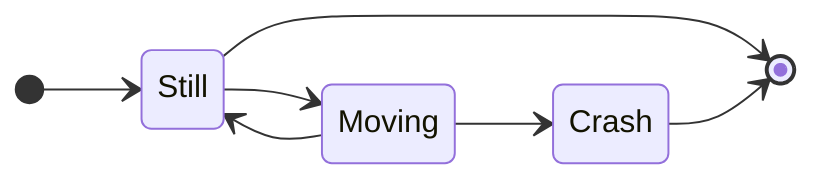
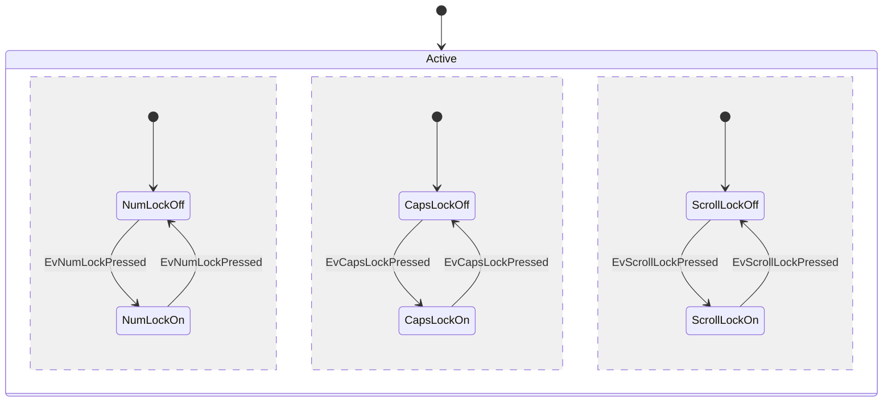

## state diagram

```mermaid
stateDiagram-v2
        direction LR
        [*] --> Still
        Still --> [*]
    
        Still --> Moving
        Moving --> Still
        Moving --> Crash
        Crash --> [*]

```

## complex

```mermaid
stateDiagram-v2
        [*] --> Active
    
        state Active {
            [*] --> NumLockOff
            NumLockOff --> NumLockOn : EvNumLockPressed
            NumLockOn --> NumLockOff : EvNumLockPressed
            --
            [*] --> CapsLockOff
            CapsLockOff --> CapsLockOn : EvCapsLockPressed
            CapsLockOn --> CapsLockOff : EvCapsLockPressed
            --
            [*] --> ScrollLockOff
            ScrollLockOff --> ScrollLockOn : EvScrollLockPressed
            ScrollLockOn --> ScrollLockOff : EvScrollLockPressed
        }


```
